# LTI — Documento de Diseño de Software (MMX)

## Metadatos del documento

| Campo | Valor |
|-------|-------|
| **Proyecto** | LTI — Applicant Tracking System (ATS) |
| **Versión del documento** | 1.0 |
| **Autor** | Equipo de diseño — MMX |
| **Fecha** | Mayo 2026 |
| **Estado** | Completo — revisión académica |
| **Alcance** | MVP multi-tenant SaaS con asistencia de IA |

---

# 1. Resumen Ejecutivo

## 1.1 Descripción general del producto

**LTI** es una plataforma **Applicant Tracking System (ATS)** diseñada como **SaaS multi-tenant en la nube**, orientada a equipos de Recursos Humanos y reclutamiento que necesitan centralizar el ciclo de contratación — desde la publicación de vacantes hasta la contratación — con **automatización de tareas repetitivas** y **asistencia de inteligencia artificial integrada en el flujo de trabajo**.

El producto aborda el proceso de selección como un **pipeline colaborativo** gestionado por reclutadores y hiring managers, con un portal limitado para candidatos. La arquitectura prioriza un **MVP realista**: backend modular, APIs REST, servicios desacoplados para evaluación con IA y notificaciones, y cumplimiento **GDPR-by-design** desde el diseño inicial.

LTI no sustituye el criterio humano en las decisiones de contratación; incorpora un modelo **human-in-the-loop (HITL)** en el que las recomendaciones del **AI Candidate Evaluation Service** son siempre revisables, explicables y auditables antes de afectar el estado de una `Application`.

## 1.2 Problema de negocio

Los departamentos de talento en pymes y empresas medianas enfrentan problemas estructurales recurrentes:

| Problema | Impacto operativo |
|----------|-------------------|
| **Volumen elevado de candidaturas** por vacante | Saturación del tiempo del reclutador en tareas de filtrado manual |
| **Herramientas ATS fragmentadas o genéricas** | Poca visibilidad del pipeline, duplicidad de datos y baja colaboración recruiter–manager |
| **Coordinación ineficiente de entrevistas** | Retrasos en el time-to-hire por fricción en agendas y comunicación |
| **Falta de trazabilidad en decisiones** | Dificultad para justificar descartes, cumplir auditorías y reducir sesgos |
| **Cumplimiento normativo (GDPR)** tratado como añadido posterior | Riesgo legal y pérdida de confianza del candidato |

Los ATS tradicionales suelen optimizar el almacenamiento de CVs, pero **no reducen de forma proporcional el trabajo cognitivo** del reclutador ni **facilitan la co-decisión** entre roles de selección. LTI nace para cerrar esa brecha con automatización inteligente y flujos colaborativos nativos.

## 1.3 Público objetivo

| Segmento | Perfil | Necesidad principal |
|----------|--------|---------------------|
| **Primario** | Empresas de **50–500 empleados** con función de RR. HH. interna o agencia de reclutamiento | ATS moderno, asequible y conforme a normativa europea |
| **Usuarios internos** | **Recruiters**, **Hiring Managers** y **Organization Admins** | Eficiencia operativa, visibilidad del pipeline y colaboración |
| **Usuarios externos** | **Candidates** en procesos activos | Experiencia simple para aplicar, subir documentación y gestionar entrevistas |
| **Secundario (futuro)** | Scale-ups en crecimiento acelerado | Escalabilidad del volumen de candidaturas sin degradar calidad de screening |

**Mercado geográfico inicial:** España y Unión Europea, donde el cumplimiento de protección de datos y la explicabilidad de decisiones asistidas por IA son requisitos de adopción, no opcionales.

## 1.4 Propuesta de valor

LTI ofrece un **único sistema de verdad** para el proceso de selección, combinando:

1. **Gestión unificada** de `JobOffer`, `Candidate`, `Application` e `Interview` en un pipeline con estados explícitos.
2. **Screening asistido por IA** que genera `AIRecommendation` con puntuación, razones y evidencia citada, sujeto a validación humana obligatoria.
3. **Colaboración en tiempo real** entre recruiter y hiring manager sobre el mismo candidato y la misma vacante.
4. **Automatización operativa** de notificaciones, recordatorios y programación de entrevistas integrada con calendarios corporativos.
5. **Cumplimiento y auditabilidad** mediante consentimiento del candidato, políticas de retención por `Organization` y `AuditLog` de acciones sensibles.

**Resultado esperado para el cliente:** reducción del tiempo medio de preselección, menor fricción en la coordinación de entrevistas y mayor consistencia y trazabilidad en las decisiones de contratación.

## 1.5 Ventajas competitivas

| Ventaja | Descripción |
|---------|-------------|
| **Diseño colaborativo nativo** | Flujos pensados para recruiter + hiring manager, no como módulo añadido |
| **IA con gobernanza** | HITL, explicabilidad y registro de override humano frente a recomendaciones automáticas opacas |
| **GDPR-by-design** | Minimización de PII, retención configurable y derecho al olvido modelados desde el MVP |
| **Arquitectura cloud-native pragmática** | Time-to-market de startup sin deuda de overengineering; evolución modular hacia microservicios |
| **Búsqueda y analítica integradas** | Indexación full-text y métricas de pipeline para decisiones basadas en datos |
| **Coste total de propiedad moderado** | Stack gestionado (IdP, object storage, colas, LLM vía API) alineado con presupuesto de startup |

Frente a ATS enterprise (complejidad, coste, largos ciclos de implantación) y herramientas genéricas (Notion, hojas de cálculo), LTI se posiciona en el **segmento medio-alto accesible**: funcionalidad profesional con despliegue SaaS inmediato.

## 1.6 Diferenciadores basados en IA

Los diferenciadores de IA en LTI están acotados al **MVP** y alineados con restricciones éticas y técnicas del proyecto:

| Diferenciador | Funcionamiento | Límite deliberado (MVP) |
|---------------|----------------|-------------------------|
| **Screening semántico de candidatos** | El **AI Candidate Evaluation Service** compara perfil/CV con criterios de `JobOffer` y produce `AIRecommendation` | No hay contratación automática; el estado de `Application` solo avanza con acción humana o regla explícita post-revisión |
| **Recomendaciones explicables** | Cada recomendación incluye score, factores ponderados y fragmentos de evidencia del CV | No se presentan cajas negras; versión de modelo y timestamp registrados |
| **Copiloto del reclutador** | Asistencia en redacción de feedback, resúmenes de candidato y sugerencias de preguntas de entrevista | Asistencia generativa, no decisión autónoma |
| **Priorización del pipeline** | Ordenación sugerida de `Application` en estado `SCREENING` por ajuste a requisitos | El recruiter puede reordenar y anular sugerencias (`OVERRIDDEN`) |
| **Detección de duplicados y enriquecimiento** | Identificación de candidatos ya presentes en la `Organization` | Requiere confirmación humana antes de fusionar registros |

La estrategia de IA prioriza **productividad del reclutador** y **reducción de sesgo operativo** (menos descartes por fatiga o criterios inconsistentes), no la sustitución del juicio profesional. El proveedor de LLM y embeddings es externo (API), con una capa de abstracción interna que permite evolucionar modelos sin reescribir el dominio de negocio.

---

# 2. Lean Canvas

El **Lean Canvas** de LTI modela el negocio del MVP SaaS multi-tenant descrito en el Resumen Ejecutivo. Las hipótesis siguientes son **realistas para una startup HR tech en fase inicial** (presupuesto limitado, mercado UE, validación con primeros tenants `Organization`).

## 2.1 Tabla Lean Canvas

| Bloque | Contenido |
|--------|-----------|
| **Problema** | 1. Reclutadores dedican **>60 % del tiempo** a preselección manual de CVs frente a criterios heterogéneos por `JobOffer`.<br>2. **Falta de visibilidad compartida** del pipeline entre `Recruiter` y `HiringManager`, con decisiones en email/hojas de cálculo.<br>3. **Time-to-hire elevado** por coordinación manual de `Interview` (agendas, recordatorios, cancelaciones).<br>4. **Riesgo GDPR y de auditoría**: consentimiento del `Candidate`, retención y justificación de descartes poco trazables.<br>5. ATS legacy **caros o rígidos** para pymes (50–500 empleados) que no justifican licencias enterprise. |
| **Segmentos de cliente** | **Primario:** `Organization` (empresas 50–500 empleados) con 1–5 `Recruiter` y varios `HiringManager` por vacante.<br>**Secundario:** Agencias de reclutamiento boutique (multi-vacante, alto volumen de `Application`).<br>**Geografía MVP:** España y UE (requisito GDPR y explicabilidad de `AIRecommendation`).<br>**Excluido en MVP:** Grandes enterprise (>2.000 empleados) con RFP complejos e integraciones legacy on-premise. |
| **Propuesta de valor única (UVP)** | *«El ATS europeo que reduce la preselección manual con IA explicable y colaboración nativa entre reclutador y manager — sin sacrificar control humano ni cumplimiento GDPR.»*<br>Un solo pipeline (`Application` con estados `NEW` → `SCREENING` → …) con **HITL** obligatorio y `AuditLog` integrado. |
| **Solución** | Plataforma LTI SaaS: gestión de `JobOffer`, `Candidate`, `Application`, `Interview`, `Evaluation`; **AI Candidate Evaluation Service** → `AIRecommendation` explicable; **Notification Service**; scheduling con Calendar Integration; búsqueda full-text; portal `Candidate`; panel analítico de pipeline por `Organization`. |
| **Canales** | **Adquisición:** contenido especializado (GDPR + IA en recruiting), webinars con comunidades RR. HH., outbound a directores de talento en pymes.<br>**Activación:** trial 14 días por `Organization` (1 vacante activa, hasta 50 `Application`).<br>**Retención:** onboarding guiado, soporte en español/inglés, documentación de cumplimiento.<br>**Futuro (post-MVP):** marketplace de integraciones (LinkedIn, InfoJobs, IdP corporativos). |
| **Flujos de ingresos** | **Suscripción mensual/anual por tenant** (`Organization`), escalonada por número de usuarios internos (`Recruiter` + `HiringManager` + `Organization Admin`):<br>• *Starter:* hasta 3 usuarios, 2 `JobOffer` activas.<br>• *Growth:* hasta 10 usuarios, 10 `JobOffer` activas, screening IA incluido (límite mensual de inferencias).<br>• *Scale:* usuarios ilimitados, `JobOffer` ampliadas, SLA prioritario.<br>**Add-on opcional:** paquete extra de evaluaciones IA y almacenamiento `Attachment` (>límite base).<br>**Hipótesis de precio MVP:** 149–399 €/mes por tenant según tramo (validar con 10 entrevistas de cliente). |
| **Estructura de costes** | **Fijos:** equipo núcleo (2–3 ingenieros, 1 producto/HR domain, 1 comercial part-time); legal/compliance GDPR; herramientas (CI/CD, observabilidad).<br>**Variables por tenant:** compute cloud (API + workers), object storage (`Attachment`), OpenSearch, **inferencia LLM/embeddings** (coste marginal por `AIRecommendation`), email transaccional, IdP por MAU.<br>**Principal palanca de margen:** límites de screening IA por plan + caché de embeddings por `Application` ya evaluada. |
| **Métricas clave** | **Producto:** tiempo medio en estado `SCREENING` (−30 % objetivo a 6 meses); % `AIRecommendation` en estado `ACCEPTED` vs `OVERRIDDEN`; tiempo de coordinación hasta `Interview` confirmada.<br>**Negocio:** MRR, churn logo mensual (<5 % objetivo año 1), CAC payback (<12 meses), NRR.<br>**Cliente (outcome):** time-to-hire del cliente, tasa de conversión `Application` → `HIRED`, satisfacción recruiter (CSAT ≥ 4/5).<br>**Cumplimiento:** % `Organization` con política de retención configurada; incidentes PII (objetivo: 0). |
| **Ventaja injusta (Unfair Advantage)** | 1. **Gobernanza de IA nativa** (HITL + explicabilidad + `AuditLog`) difícil de replicar rápido por ATS legacy orientados a checklist.<br>2. **Diseño de dominio cohesivo** (entidades y estados alineados con flujo real recruiter–manager, no módulos acoplados a posteriori).<br>3. **Enfoque regulatorio UE** como restricción de diseño (GDPR-by-design), no como feature tardía.<br>4. *Hipótesis a validar:* advisory board con 2–3 heads of talent de pymes piloto que co-diseñen criterios de screening.<br>*No se reclama* ventaja por «tener IA» (commodity); la ventaja es **confianza operativa + cumplimiento + velocidad de iteración** en el segmento medio. |

## 2.2 Hipótesis de negocio críticas (MVP)

| ID | Hipótesis | Criterio de validación |
|----|-----------|------------------------|
| H-B1 | Pymes 50–500 empleados pagarán **149–249 €/mes** por ATS con IA explicable | ≥3 LOI (carta de intención) en piloto de 90 días |
| H-B2 | El screening con `AIRecommendation` reduce **≥25 %** el tiempo en `SCREENING` | Medición antes/después en 2 `Organization` piloto |
| H-B3 | La colaboración recruiter–manager en la misma `Application` reduce emails externos **≥40 %** | Encuesta + telemetría de comentarios in-app |
| H-B4 | El coste variable de inferencia IA permite margen bruto **>70 %** en plan Growth | Modelo de coste por 1.000 `Application` evaluadas |

## 2.3 Diagrama Lean Canvas (Mermaid)

El diagrama siguiente representa la **disposición clásica** del Lean Canvas y las **dependencias** entre bloques para LTI. El detalle de cada celda está en la tabla §2.1.

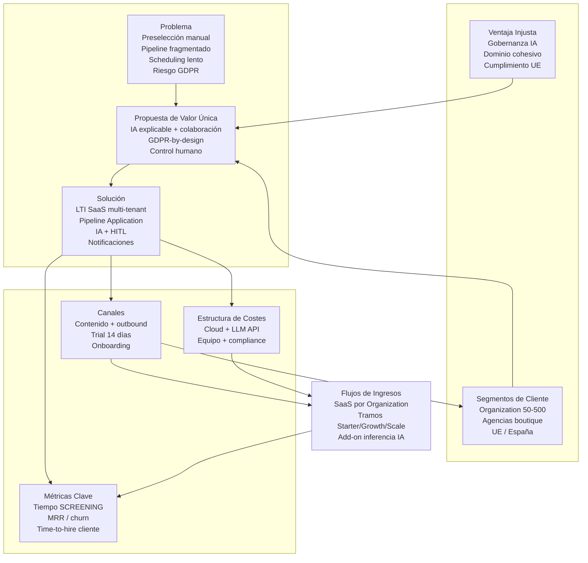

## 2.4 Relación Lean Canvas ↔ modelo de dominio

| Bloque canvas | Artefactos / actores LTI |
|---------------|--------------------------|
| Problema | Saturación en `SCREENING`, fricción en `Interview`, gaps en `AuditLog` |
| Segmentos | `Organization`, roles `Recruiter`, `HiringManager`, `Organization Admin` |
| Solución | Servicios: API REST, **AI Candidate Evaluation Service**, **Notification Service**, Calendar Integration |
| Métricas | Transiciones de estado `Application`, estados `AIRecommendation`, volumen por tenant |
| Ingresos | Licencia por `organization_id`; límites por `JobOffer` activas y usuarios internos |

---

# 3. Funcionalidades Principales

Este capítulo describe **once funcionalidades** (§3.1–§3.11) incluidas en el **alcance MVP** de LTI. Todas operan sobre las entidades y actores ya definidos, dentro de la **arquitectura modular monolítica** (API REST + workers asíncronos) y los servicios desacoplados **AI Candidate Evaluation Service** y **Notification Service**.

**Fuera de alcance MVP** (referencia Roadmap §10): matching predictivo candidato–vacante a escala, asistentes de entrevista por voz, mobility interna, BPM enterprise, SSO custom on-premise, multi-idioma completo más allá de ES/EN en UI.

## 3.0 Criterios transversales del MVP

| Criterio | Aplicación en todas las funcionalidades |
|----------|----------------------------------------|
| **Multi-tenant** | Aislamiento por `organization_id`; ningún dato de negocio cruza `Organization` |
| **HITL** | La IA propone; el humano confirma, rechaza o anula (`OVERRIDDEN`) antes de impacto irreversible |
| **Trazabilidad** | Acciones sensibles registradas en `AuditLog` (acceso PII, cambios de estado, revisión de `AIRecommendation`) |
| **Asincronía** | Screening IA, notificaciones e indexación vía cola de mensajes; la API REST no bloquea inferencia |

---

## 3.1 Administración multi-tenant y control de acceso

| Campo | Descripción |
|-------|-------------|
| **Objetivo** | Permitir que cada `Organization` configure su tenant, usuarios internos y permisos RBAC sin despliegue dedicado. |
| **Usuarios implicados** | `Organization Admin`, `Recruiter`, `HiringManager` (asignación de rol vía `User`) |
| **Entidades** | `Organization`, `User` |
| **Flujo general** | 1) El admin crea o importa usuarios vinculados al IdP externo. 2) Asigna rol y permisos (`RECRUITER`, `HIRING_MANAGER`, `ORG_ADMIN` en `user.role`). 3) Configura política de retención de datos del tenant. 4) Los usuarios acceden solo a recursos de su `organization_id`. |
| **Valor de negocio** | Base operativa del SaaS; reduce riesgo de fuga de datos entre clientes y facilita cumplimiento GDPR por tenant (supuesto A7). |
| **Rol de la IA** | **Ninguno** en MVP. |
| **Limitaciones MVP** | Sin SSO SAML custom ni SCIM; autenticación delegada al IdP gestionado estándar. Sin sub-organizaciones ni jerarquías de permisos granulares (solo roles fijos). |

---

## 3.2 Gestión de ofertas de empleo (`JobOffer`)

| Campo | Descripción |
|-------|-------------|
| **Objetivo** | Crear, publicar y cerrar vacantes con requisitos explícitos que alimenten el screening y el pipeline de `Application`. |
| **Usuarios implicados** | `Recruiter` (propietario operativo), `HiringManager` (consulta y validación de requisitos) |
| **Entidades** | `JobOffer`, `Organization`, `job_offer_hiring_manager`; `User` con rol `RECRUITER` como `primary_recruiter_id` de la vacante |
| **Flujo general** | 1) El recruiter define título, descripción, requisitos obligatorios/opcionales y criterios de evaluación. 2) Asocia hiring managers a la vacante. 3) Publica la oferta (estado activa/cerrada). 4) Las nuevas `Application` se vinculan automáticamente a la `JobOffer` activa. |
| **Valor de negocio** | Punto de origen del pipeline; alinea expectativas recruiter–manager y reduce criterios implícitos en la preselección (problema §1.2). |
| **Rol de la IA** | **Asistencia opcional** en redacción de descripción y extracción de requisitos estructurados desde texto libre (misma capa LLM, sin persistir decisión automática). El recruiter edita y guarda manualmente. |
| **Limitaciones MVP** | Sin multiposting automático a portales externos (LinkedIn, InfoJobs). Sin plantillas enterprise por familia profesional. Máximo de `JobOffer` activas según plan (Lean Canvas §2.1). |

---

## 3.3 Gestión de candidatos y postulaciones (`Candidate`, `Application`)

| Campo | Descripción |
|-------|-------------|
| **Objetivo** | Registrar candidatos, sus documentos y postulaciones con trazabilidad de origen y consentimiento. |
| **Usuarios implicados** | `Recruiter`, `Candidate` (portal/enlace seguro), `HiringManager` (solo lectura según permiso) |
| **Entidades** | `Candidate`, `Application`, `Attachment`; estados iniciales `NEW` |
| **Flujo general** | 1) El candidato aplica a una `JobOffer` activa (formulario + CV en `Attachment`). 2) Se registra consentimiento GDPR y fuente de captación. 3) Se crea `Application` en estado `NEW`. 4) El recruiter revisa duplicados sugeridos (mismo email en la `Organization`) y confirma o fusiona manualmente. 5) Transición manual o por regla simple a `SCREENING`. |
| **Valor de negocio** | Sistema de verdad del proceso; elimina hojas de cálculo y correos sueltos como repositorio de candidatos (UVP §2.1). |
| **Rol de la IA** | **Detección de duplicados** por similitud de email/nombre (regla + embedding opcional); el recruiter **debe confirmar** antes de fusionar. Sin scraping ni sourcing automático de perfiles externos. |
| **Limitaciones MVP** | Portal candidato básico (aplicar, subir `Attachment`, ver estado propio). Sin CRM de talento ni nurturing por campañas. Sin parsing avanzado de CV para todos los formatos (PDF/DOC prioritarios). |

---

## 3.4 Screening asistido por IA (`AIRecommendation`)

| Campo | Descripción |
|-------|-------------|
| **Objetivo** | Reducir tiempo de preselección comparando perfil/CV del candidato con criterios de la `JobOffer`, generando recomendaciones **explicables** sujetas a revisión humana. |
| **Usuarios implicados** | `Recruiter` (revisor principal), `HiringManager` (consulta opcional) |
| **Entidades** | `Application` (estado `SCREENING`), `AIRecommendation`, `JobOffer`, `Attachment`, `AuditLog` |
| **Flujo general** | 1) Al entrar en `SCREENING`, el monolito encola evaluación (`application.screening.requested`). 2) El **AI Candidate Evaluation Service** ejecuta `GET` contexto → inferencia LLM → `POST` callback al monolito (sin persistir datos). 3) El monolito persiste `AIRecommendation` (`PENDING_REVIEW`) con score, razones y citas. 4) El recruiter revisa en UI: `ACCEPTED`, `REJECTED` u `OVERRIDDEN`. 5) Transición de `Application`: `INTERVIEW` solo si `AIRecommendation` es `ACCEPTED` u `OVERRIDDEN`; si es `REJECTED`, solo `REJECTED` u permanencia en `SCREENING` (§5.4). |
| **Valor de negocio** | Palanca central del UVP y métrica H-B2 (reducción tiempo en `SCREENING`); diferenciador frente a ATS que solo almacenan CVs. |
| **Rol de la IA** | **Núcleo:** scoring semántico y explicación vía LLM + embeddings (proveedor externo). **No decide** contratación ni rechazo automático. Cada inferencia registra versión de modelo y timestamp. |
| **Limitaciones MVP** | Cuota de evaluaciones por plan; sin reentrenamiento de modelos propios; sin evaluación batch masiva offline; un `AIRecommendation` activo por `Application` por ciclo de screening. Re-evaluación manual dispara nuevo registro, no sobrescribe historial. |

---

## 3.5 Colaboración recruiter–hiring manager (`Evaluation`)

| Campo | Descripción |
|-------|-------------|
| **Objetivo** | Centralizar feedback y decisiones compartidas sobre una `Application` sin depender de email o herramientas paralelas. |
| **Usuarios implicados** | `Recruiter`, `HiringManager` |
| **Entidades** | `Application`, `Evaluation`, `AIRecommendation` (referencia opcional), `AuditLog` |
| **Flujo general** | 1) Tras screening, el recruiter comparte la `Application` con hiring managers asignados a la `JobOffer`. 2) Cada manager completa `Evaluation` (rúbrica simple, nota, comentario, recomendación). 3) Pueden citar o contrastar `AIRecommendation` sin que esta sustituya su juicio. 4) El recruiter consolida y propone siguiente estado (`INTERVIEW`, `REJECTED`, etc.). |
| **Valor de negocio** | Responde al problema de pipeline fragmentado (§1.2, hipótesis H-B3); visibilidad compartida en un único artefacto `Application`. |
| **Rol de la IA** | **Copiloto de redacción** al elaborar comentarios de `Evaluation` (borrador editable). **Sin** generación automática de evaluaciones finales ni votación algorítmica. |
| **Limitaciones MVP** | Sin videollamada integrada ni evaluación por competencias con bancos de rúbricas enterprise. Comentarios en hilo único por `Application`, no chat en tiempo real tipo Slack. |

---

## 3.6 Programación de entrevistas (`Interview`)

| Campo | Descripción |
|-------|-------------|
| **Objetivo** | Coordinar `Interview` entre participantes internos y `Candidate` reduciendo fricción de agendas. |
| **Usuarios implicados** | `Recruiter`, `HiringManager`, `Candidate` |
| **Entidades** | `Interview`, `Application`, integración **Calendar Integration** (Google / Microsoft) |
| **Flujo general** | 1) Con `Application` en estado `INTERVIEW`, el recruiter define tipo, duración y participantes. 2) Consulta disponibilidad vía Calendar Integration (OAuth por usuario interno). 3) Propone franjas al candidato (enlace seguro). 4) Al confirmar, se crea `Interview` con estado programada y enlace/notas. 5) Cambios o cancelaciones actualizan `Interview` y disparan `Notification`. |
| **Valor de negocio** | Reduce time-to-hire por menor latencia en coordinación (métrica §2.1: tiempo hasta `Interview` confirmada). |
| **Rol de la IA** | **Ninguno** obligatorio. Sugerencia opcional de franjas según historial de aceptación (heurística simple, no ML dedicado en MVP). |
| **Limitaciones MVP** | Solo integración con un proveedor de calendario por `Organization` en fase piloto. Sin sala de vídeo propia (enlace externo en campo de `Interview`). Sin scheduling multi-entrevista en cadena automática. |

---

## 3.7 Notificaciones operativas (`Notification`)

| Campo | Descripción |
|-------|-------------|
| **Objetivo** | Informar a actores internos y candidatos de eventos relevantes del pipeline sin seguimiento manual. |
| **Usuarios implicados** | `Recruiter`, `HiringManager`, `Candidate`, `Organization Admin` (alertas de sistema) |
| **Entidades** | `Notification`; servicio **Notification Service** (email + in-app) |
| **Flujo general** | 1) Eventos de dominio (nueva `Application`, `AIRecommendation` lista, `Interview` confirmada, cambio de estado) publican mensaje en cola. 2) Notification Service renderiza plantilla y entrega canal configurado. 3) El usuario marca notificaciones leídas en UI. |
| **Valor de negocio** | Automatización operativa de bajo coste; evita que candidatos o managers queden bloqueados por falta de aviso (canales §2.1). |
| **Rol de la IA** | **Ninguno.** Plantillas estáticas; sin personalización generativa de emails en MVP. |
| **Limitaciones MVP** | Canales: email transaccional e in-app únicamente. Sin SMS, WhatsApp ni push móvil nativo. Preferencias de notificación básicas por `User`. |

---

## 3.8 Búsqueda y filtrado (índice full-text)

| Campo | Descripción |
|-------|-------------|
| **Objetivo** | Localizar rápidamente `Candidate`, `Application` y `JobOffer` dentro del tenant mediante búsqueda textual y filtros de pipeline. |
| **Usuarios implicados** | `Recruiter`, `HiringManager` (alcance acotado a vacantes asignadas) |
| **Entidades** | `Candidate`, `Application`, `JobOffer`, `Attachment` (metadatos indexados); motor de búsqueda sincronizado por eventos (supuesto A10) |
| **Flujo general** | 1) Tras alta o cambio de entidades, un worker publica documento en índice (nombre, email, título vacante, texto extraído de CV si existe). 2) El usuario busca y aplica filtros (estado `Application`, `JobOffer`, fechas). 3) Resultados siempre filtrados por `organization_id`. |
| **Valor de negocio** | Productividad del recruiter con volumen moderado de candidaturas; soporte a pymes sin equipo de analítica de datos. |
| **Rol de la IA** | **Ninguno** en la búsqueda MVP (keyword + filtros). La semántica profunda queda en §3.4 (screening por vacante), no en búsqueda global tipo «encuentra perfiles similares». |
| **Limitaciones MVP** | Sin búsqueda federada cross-tenant. Sin sinónimos ni ranking neuronal en barra de búsqueda. Reindexación eventual (consistencia eventual). |

---

## 3.9 Automatización básica de workflow del pipeline

| Campo | Descripción |
|-------|-------------|
| **Objetivo** | Aplicar reglas simples de transición y recordatorios sobre estados de `Application`, sin motor BPM enterprise. |
| **Usuarios implicados** | `Recruiter` (configuración limitada por `Organization`), `LTI Platform (System)` (ejecución) |
| **Entidades** | `Application`, `Notification`, `JobOffer` |
| **Flujo general** | 1) Reglas predefinidas por tenant: p. ej. «si `AIRecommendation` = `ACCEPTED` y sin actividad 48 h → recordatorio al recruiter». 2) «Al pasar a `INTERVIEW`, notificar hiring managers asignados» (solo si la transición cumple §5.4: no con `AIRecommendation` = `REJECTED`). 3) Transiciones de estado **siempre** iniciadas por usuario autenticado; nunca por score IA aislado. 4) Registro en `AuditLog`. |
| **Valor de negocio** | Reduce tareas repetitivas de seguimiento sin prometer «automatización mágica»; coherente con presupuesto startup (workers + reglas, no plataforma de reglas visual compleja). |
| **Rol de la IA** | **Disparador condicionado** solo tras `AIRecommendation` humana en `ACCEPTED` u `OVERRIDDEN`. Con `REJECTED`, las reglas no pueden disparar → `INTERVIEW`. |
| **Limitaciones MVP** | Catálogo cerrado de reglas (≤5 tipos); sin editor visual de flujos ni ramas paralelas complejas. Sin integraciones Zapier en MVP. |

---

## 3.10 Analítica básica del pipeline

| Campo | Descripción |
|-------|-------------|
| **Objetivo** | Ofrecer visibilidad agregada del embudo de contratación por `Organization` y por `JobOffer` para decisiones operativas. |
| **Usuarios implicados** | `Recruiter`, `HiringManager`, `Organization Admin` |
| **Entidades** | `Application` (conteo por estado), `Interview`, `AIRecommendation` (tasas de aceptación/override), `JobOffer` |
| **Flujo general** | 1) Consultas agregadas sobre BD operacional (y/o réplica de lectura ligera en MVP). 2) Dashboard: candidatos por estado, tiempo medio en `SCREENING`, conversión a `HIRED`, ratio `OVERRIDDEN`. 3) Exportación CSV manual para reporting externo. |
| **Valor de negocio** | Soporta métricas clave del Lean Canvas (§2.1) sin inversión en data warehouse; demuestra ROI al cliente piloto. |
| **Rol de la IA** | **Ninguno** en cálculo de métricas. Insights textuales opcionales («resumen semanal del pipeline») vía LLM bajo demanda, con disclaimer y sin persistencia obligatoria. |
| **Limitaciones MVP** | Sin predicción de contratación ni benchmarking entre tenants. Sin BI embebido avanzado (Drill-down limitado a vacante y rango de fechas). Datos históricos ≤12 meses en plan Starter. |

---

## 3.11 Copiloto del reclutador (asistencia generativa acotada)

| Campo | Descripción |
|-------|-------------|
| **Objetivo** | Asistir al `Recruiter` en tareas de redacción y síntesis sobre datos ya presentes en el tenant, acelerando comunicación sin automatizar decisiones. |
| **Usuarios implicados** | `Recruiter` (principal); `HiringManager` (solo lectura de sugerencias si se comparte) |
| **Entidades** | `Application`, `Candidate`, `JobOffer`, `Attachment`, `Evaluation` (contexto de entrada) |
| **Flujo general** | 1) El recruiter solicita acción explícita: resumir CV, proponer preguntas de entrevista alineadas a `JobOffer`, borrador de feedback. 2) La API invoca LLM con contexto acotado al `organization_id` y registro en `AuditLog`. 3) El usuario edita y pega/confirma en `Evaluation` o comunicación externa; nada se publica automáticamente al candidato. |
| **Valor de negocio** | Complementa screening (§3.4) en fases posteriores; mejora percepción de productividad sin coste de un segundo servicio de IA. |
| **Rol de la IA** | **Asistencia generativa bajo demanda** (misma abstracción de proveedor que el AI Candidate Evaluation Service, invocación síncrona con timeout corto). **HITL estricto:** salida siempre editable; no envía emails ni cambia estados. |
| **Limitaciones MVP** | Sin agentes autónomos multi-paso. Sin acceso a datos fuera del tenant. Límite de tokens por solicitud y cuota mensual compartida con screening. Sin garantía de veracidad factual: UI muestra aviso de revisión humana. |

---

## 3.12 Mapa funcionalidad ↔ entidades ↔ servicios

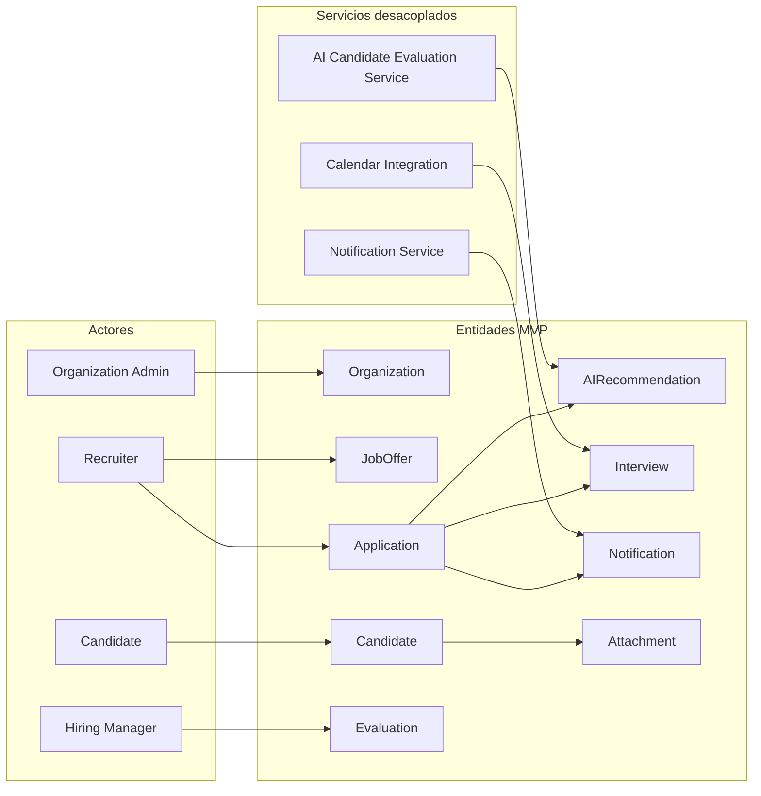

## 3.13 Resumen de cobertura MVP

| # | Funcionalidad | IA en MVP | Entidades principales |
|---|---------------|-----------|------------------------|
| 3.1 | Administración multi-tenant | No | `Organization`, `User` |
| 3.2 | Gestión de `JobOffer` | Asistencia redacción (opcional) | `JobOffer` |
| 3.3 | Candidatos y `Application` | Duplicados sugeridos | `Candidate`, `Application`, `Attachment` |
| 3.4 | Screening asistido | **Core (HITL)** | `AIRecommendation`, `Application` |
| 3.5 | Colaboración / `Evaluation` | Borrador de texto | `Evaluation` |
| 3.6 | `Interview` + calendario | No (heurística opcional) | `Interview` |
| 3.7 | `Notification` | No | `Notification` |
| 3.8 | Búsqueda full-text | No | Índice sobre entidades existentes |
| 3.9 | Workflow básico | Solo post-revisión humana IA | `Application`, `Notification` |
| 3.10 | Analítica básica | Resumen opcional | Agregados de `Application` |
| 3.11 | Copiloto recruiter | Generativa bajo demanda | Contexto de entidades existentes |

---

# 4. Casos de Uso Principales

Este capítulo formaliza **tres casos de uso** derivados directamente de las funcionalidades MVP aprobadas:

| Caso de uso | Funcionalidad origen | ID |
|-------------|---------------------|-----|
| Screening asistido por IA | §3.4 | **UC-01** |
| Workflow colaborativo de contratación | §3.5 (+ reglas §3.9) | **UC-02** |
| Programación de entrevistas | §3.6 (+ §3.7 notificaciones) | **UC-03** |

Los flujos asumen **backend modular monolítico** (API REST + reglas de dominio) y procesamiento asíncrono vía cola para inferencia IA y notificaciones. La IA **nunca** cambia el estado de `Application` sin acción humana explícita posterior (HITL).

---

## 4.1 UC-01 — Screening asistido por IA de candidatos

### Objetivo

Evaluar de forma asistida una `Application` en estado `SCREENING` mediante el **AI Candidate Evaluation Service**, generar una `AIRecommendation` explicable y someterla a revisión humana obligatoria antes de cualquier avance o rechazo en el pipeline.

### Actores

| Actor | Participación |
|-------|---------------|
| **Recruiter** | Dispara screening, revisa y resuelve `AIRecommendation`; decide transición de `Application` |
| **LTI Platform (System)** | Valida RBAC, publica eventos, persiste estados, registra `AuditLog` |
| **AI Candidate Evaluation Service** | Consume cola; `GET` contexto al monolito; lee CV en object storage; invoca **LLM / Embedding Provider**; `POST` callback (sin persistencia ni notificaciones) |
| **Notification Service** | Notifica fin de evaluación o errores operativos |

*Actores no participantes en este UC:* `HiringManager` (sin permiso de resolución de `AIRecommendation` en MVP), `Candidate`.

### Precondiciones

1. El `Recruiter` está autenticado vía **Identity Provider (IdP)** y pertenece a una `Organization` activa.
2. Existe una `JobOffer` **activa** con criterios de screening definidos.
3. La `Application` pertenece a esa `JobOffer` y al mismo `organization_id` que el recruiter.
4. La `Application` está en estado `NEW` o el recruiter va a transicionarla a `SCREENING`.
5. El `Candidate` tiene **consentimiento GDPR** registrado y al menos un `Attachment` (CV) en formato soportado (PDF/DOC).
6. La `Organization` dispone de **cuota de inferencia IA** disponible (plan Lean Canvas §2.1).

### Flujo principal

| Paso | Actor | Acción |
|------|-------|--------|
| 1 | Recruiter | Abre la `Application` y solicita paso a `SCREENING` (o crea la postulación ya en `SCREENING` tras revisión inicial en `NEW`). |
| 2 | LTI Platform | Valida RBAC (`Recruiter` sobre `JobOffer`), consentimiento y presencia de CV. Si OK, actualiza `Application` → `SCREENING` y registra `AuditLog`. |
| 3 | LTI Platform | Publica `application.screening.requested`; actualiza `screening_job_status` → `QUEUED`; responde HTTP **202** con `screening_job_id`. |
| 4 | AI Candidate Evaluation Service | Consume mensaje; `GET /internal/.../screening/context` (monolito puede marcar `PROCESSING`). |
| 5 | AI Candidate Evaluation Service | Lee CV en object storage; invoca LLM/embeddings; construye DTO de recomendación. |
| 6 | AI Candidate Evaluation Service | `POST /internal/.../screening/callback` con resultado (`success` true/false). **No** escribe en BD ni publica notificaciones. |
| 7 | LTI Platform | En transacción: persiste `AIRecommendation` (`PENDING_REVIEW` si éxito) o `screening_job_status` → `FAILED`; `AuditLog`; publica `notification.send.requested`. |
| 8 | Notification Service | Entrega `Notification` al `Recruiter`: «Evaluación IA lista para revisión». |
| 9 | Recruiter | Revisa score, razones y evidencia; resuelve HITL: `ACCEPTED`, `REJECTED` u `OVERRIDDEN`. |
| 10 | LTI Platform | Registra `AuditLog` de la resolución HITL. |
| 11 | Recruiter | Transiciona `Application`: → `INTERVIEW` solo si última `AIRecommendation` revisada es `ACCEPTED` u `OVERRIDDEN`; → `REJECTED` en cualquier caso permitido; **no** → `INTERVIEW` si `AIRecommendation` = `REJECTED`. |
| 12 | LTI Platform | Persiste cambio de estado; `Notification` según reglas §3.9; `AuditLog`. |

### Flujos alternativos

| ID | Condición | Comportamiento |
|----|-----------|----------------|
| **4.A1** | Fallo de extracción de texto del CV (formato corrupto o vacío) | AI Service envía callback `success: false` (`error_code: CV_PARSE_FAILED`). Monolito no crea `AIRecommendation` válida; `AuditLog` + notificación al recruiter; `Application` permanece en `SCREENING`. |
| **4.A2** | Cuota IA del tenant agotada | Evento no se procesa; API devuelve 402/429 con mensaje claro. `Notification` a `Organization Admin`. Recruiter puede reintentar tras upgrade o ciclo mensual. |
| **4.A3** | Timeout o error del LLM Provider (tras 2 reintentos con backoff) | AI Service envía callback `success: false`. Monolito marca `screening_job_status` → `FAILED` y notifica al recruiter. Sin reintento automático infinito en worker. |
| **4.A4** | `HiringManager` intenta resolver `AIRecommendation` | API rechaza con **403 Forbidden** (RBAC MVP: solo `Recruiter`). |
| **4.A5** | Recruiter marca `OVERRIDDEN` | `AIRecommendation` → `OVERRIDDEN` con motivo. Válido avanzar a `INTERVIEW` si el recruiter lo decide (la IA no bloquea por score bajo). |
| **4.A6** | `Candidate` retira candidatura (`WITHDRAWN`) durante procesamiento asíncrono | `GET` contexto devuelve **409**; worker hace callback `success: false` o ack sin callback; monolito no crea `AIRecommendation` nueva. |
| **4.A7** | Recruiter sin permiso sobre la `JobOffer` | **403**; ningún cambio de estado. |

### Postcondiciones

**Éxito (flujo principal):**

- Existe exactamente una `AIRecommendation` terminal: `ACCEPTED`, `REJECTED` u `OVERRIDDEN`.
- `Application` en `INTERVIEW`, `REJECTED`, o permanece en `SCREENING` pendiente de decisión del recruiter (si aún no ejecutó paso 10).
- Entradas de `AuditLog` para: inicio de screening, generación IA y resolución humana.

**Fallo parcial (4.A1–4.A3):**

- `Application` puede permanecer en `SCREENING` sin `AIRecommendation` válida; el proceso continúa solo por vía manual.

### Reglas de negocio vinculadas

- El estado `Application` **no** pasa a `INTERVIEW` únicamente por score IA.
- `Application` → `INTERVIEW` requiere `AIRecommendation` en `ACCEPTED` u `OVERRIDDEN` (tras HITL). Si `AIRecommendation` = `REJECTED`, **prohibido** → `INTERVIEW` (API **409**).
- Estados válidos de `AIRecommendation`: `PENDING_REVIEW` → (`ACCEPTED` \| `REJECTED` \| `OVERRIDDEN`).
- Toda lectura de PII del `Candidate` queda auditada (GDPR).

---

## 4.2 UC-02 — Workflow colaborativo de contratación

### Objetivo

Permitir que `Recruiter` y `HiringManager` colaboren en la misma `Application` mediante `Evaluation` estructuradas, tras el screening, consolidando criterios antes de convocar entrevistas o rechazar.

### Actores

| Actor | Participación |
|-------|---------------|
| **Recruiter** | Orquesta el proceso, comparte candidatura, consolida feedback, cambia estado de `Application` |
| **HiringManager** | Completa `Evaluation` sobre vacantes asignadas |
| **LTI Platform (System)** | RBAC, agregación de evaluaciones, workflow §3.9 |
| **Notification Service** | Alertas de solicitud de feedback y recordatorios |

### Precondiciones

1. `Application` en estado `SCREENING` o posterior; para → `INTERVIEW` la `AIRecommendation` vigente debe estar en `ACCEPTED` u `OVERRIDDEN` (HITL completado). Si está en `REJECTED` o `PENDING_REVIEW`, **no** se permite `INTERVIEW` (§5.4).
2. La `JobOffer` tiene al menos un `HiringManager` asignado.
3. Actores autenticados y pertenecientes a la misma `Organization`.
4. El `Recruiter` es propietario operativo de la `Application`.

### Flujo principal

| Paso | Actor | Acción |
|------|-------|--------|
| 1 | Recruiter | Tras UC-01, abre `Application` y solicita evaluación a hiring managers de la `JobOffer`. |
| 2 | LTI Platform | Valida asignación HM ↔ `JobOffer`. Registra `AuditLog`. Publica evento de notificación. |
| 3 | Notification Service | Notifica a cada `HiringManager` asignado (in-app + email). |
| 4 | HiringManager | Accede a la `Application` (solo lectura/evaluación según RBAC). Revisa `AIRecommendation` si está `ACCEPTED`/`OVERRIDDEN` (referencia, no decisión automática). |
| 5 | HiringManager | Crea `Evaluation`: puntuación/rúbrica, comentario, recomendación (`proceed` / `hold` / `reject`). |
| 6 | LTI Platform | Persiste `Evaluation`, `AuditLog`. Notifica al `Recruiter` «Nueva evaluación recibida». |
| 7 | Recruiter | Revisa una o más `Evaluation`. Opcional: usa copiloto §3.11 para **borrador** de síntesis — edita y guarda notas internas (sin envío automático al candidato). |
| 8 | Recruiter | Decide: transiciona `Application` → `INTERVIEW` (convoca UC-03) o → `REJECTED`. |
| 9 | LTI Platform | Actualiza estado, `AuditLog`, `Notification` a `HiringManager`(s) y, si `REJECTED`, plantilla al `Candidate` según política GDPR del tenant. |

### Flujos alternativos

| ID | Condición | Comportamiento |
|----|-----------|----------------|
| **4.B1** | `HiringManager` no asignado a la `JobOffer` | **403** al abrir `Application`. |
| **4.B2** | Ninguna `Evaluation` tras 48 h (regla §3.9) | `Notification` recordatorio al `HiringManager` y copia al `Recruiter`. Sin cambio automático de estado. |
| **4.B3** | Evaluaciones contradictorias (un HM `proceed`, otro `reject`) | Sin resolución algorítmica. `Recruiter` documenta decisión en comentario interno y aplica paso 8. |
| **4.B4** | `Recruiter` rechaza antes de recibir evaluaciones | `Application` → `REJECTED`. `Notification` a HMs: proceso cerrado. |
| **4.B5** | Intento de pasar a `INTERVIEW` con `AIRecommendation` = `PENDING_REVIEW` | API **409 Conflict** — HITL incompleto. |
| **4.B6** | `HiringManager` intenta cambiar estado de `Application` | **403** — solo `Recruiter` transiciona estados en MVP. |
| **4.B7** | Intento de pasar a `INTERVIEW` con `AIRecommendation` = `REJECTED` | API **409 Conflict** — debe usarse `Application` → `REJECTED` u `OVERRIDDEN` previo si el recruiter discrepa con la IA. |

### Postcondiciones

- Existe al menos una `Evaluation` **o** rechazo documentado por `Recruiter` sin evaluación (caso 4.B4).
- `Application` en `INTERVIEW` o `REJECTED`.
- Historial auditable de contribuciones por actor humano.

---

## 4.3 UC-03 — Programación automatizada de entrevistas

### Objetivo

Coordinar la creación de una `Interview` para una `Application` en estado `INTERVIEW`, integrando disponibilidad de calendarios corporativos y confirmación del `Candidate`, con notificaciones automáticas.

### Actores

| Actor | Participación |
|-------|---------------|
| **Recruiter** | Inicia scheduling, define participantes y propone/confirmar franjas |
| **HiringManager** | Participante opcional; expone disponibilidad vía calendario vinculado |
| **Candidate** | Selecciona franja mediante enlace seguro (token temporal) |
| **LTI Platform (System)** | Orquesta estados de `Interview`, RBAC, tokens de enlace |
| **Calendar Integration** | Consulta free/busy y crea eventos (Google / Microsoft) |
| **Notification Service** | Confirmaciones, recordatorios y cancelaciones |

### Precondiciones

1. `Application` en estado `INTERVIEW`.
2. `Organization` con **Calendar Integration** configurada (OAuth válido para al menos un usuario interno participante).
3. `Recruiter` con permiso sobre la `JobOffer` / `Application`.
4. Datos de contacto del `Candidate` válidos para envío de enlace.

### Flujo principal

| Paso | Actor | Acción |
|------|-------|--------|
| 1 | Recruiter | Inicia «Programar entrevista» sobre la `Application`: tipo, duración, participantes internos (`HiringManager` opcional). |
| 2 | LTI Platform | Valida RBAC y estado `INTERVIEW`. Crea `Interview` en estado interno `DRAFT` (valor de dominio MVP, no confundir con estados de `Application`). |
| 3 | LTI Platform | Invoca **Calendar Integration** — consulta free/busy de participantes internos (ventana configurable, p. ej. 10 días hábiles). |
| 4 | LTI Platform | Calcula franjas candidatas (intersección de disponibilidad). Genera enlace seguro con token de un solo uso y TTL (p. ej. 72 h) para el `Candidate`. |
| 5 | Notification Service | Email al `Candidate` con enlace (sin exponer datos de otros candidatos — GDPR minimización). |
| 6 | Candidate | Autenticado por token, visualiza solo su `Application` y franjas propuestas; selecciona una. |
| 7 | LTI Platform | Confirma `Interview` → `SCHEDULED`, persiste fecha/hora/timezone, `AuditLog`. |
| 8 | Calendar Integration | Crea evento en calendarios de participantes internos; devuelve `calendar_event_id`. |
| 9 | Notification Service | Confirma a `Recruiter`, `HiringManager`(s) y `Candidate` (email + in-app para internos). |
| 10 | Recruiter | Visualiza `Interview` confirmada en ficha de `Application`. |

### Flujos alternativos

| ID | Condición | Comportamiento |
|----|-----------|----------------|
| **4.C1** | Token OAuth de calendario expirado | API devuelve **424 Failed Dependency** con código `CALENDAR_REAUTH_REQUIRED`. UI solicita reconexión al usuario interno afectado. `Interview` permanece `DRAFT`. |
| **4.C2** | Sin franjas comunes en ventana | `Notification` al `Recruiter`. Recruiter define manualmente 3–5 franjas custom (acción humana); se reenvía enlace al `Candidate`. |
| **4.C3** | `Candidate` no responde en 72 h (regla §3.9) | Recordatorio automático vía `Notification Service`. Tras segundo intento, alerta al `Recruiter` — sin auto-cancelación de `Application`. |
| **4.C4** | `Candidate` cancela vía enlace | `Interview` → `CANCELLED`. `Notification` a participantes internos. `Application` sigue en `INTERVIEW` hasta decisión del recruiter (reprogramar o `REJECTED`). |
| **4.C5** | Token de enlace expirado o inválido | Página de error genérica; recruiter regenera enlace (paso 4–5). |
| **4.C6** | `Candidate` intenta acceder a otra `Application` | **403** — token acotado a `application_id`. |
| **4.C7** | Conflicto de calendario detectado al confirmar (carrera) | Rollback de confirmación; nuevas franjas propuestas; `Notification` de disculpa y nueva selección. |

### Postcondiciones

**Éxito:**

- `Interview` en estado `SCHEDULED` con fecha/hora y referencia a Calendar Integration.
- `Notification` de confirmación emitidas.
- `AuditLog` con creación, selección de franja y evento de calendario.

**Cancelación (4.C4):**

- `Interview` → `CANCELLED`; `Application` no cambia automáticamente de estado.

### Nota sobre estados de `Interview` (MVP)

Estados internos documentados para este UC: `DRAFT`, `SCHEDULED`, `CANCELLED`. Son **independientes** de los estados de `Application` (`NEW`, `SCREENING`, `INTERVIEW`, `OFFER`, `HIRED`, `REJECTED`, `WITHDRAWN`).

---

## 4.4 Diagrama UML de casos de uso (Mermaid)

Diagrama de contexto: actores humanos y de sistema frente a los tres casos de uso del MVP. Las dependencias punteadas indican participación secundaria (trigger o soporte), no inclusión de negocio completa.

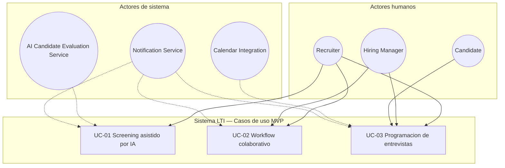

## 4.5 Matriz de trazabilidad caso de uso ↔ funcionalidad

| Elemento UC | §3 Funcionalidad | Entidades / artefactos |
|-------------|------------------|------------------------|
| UC-01 | 3.4 Screening, 3.7 Notificaciones, 3.9 Workflow (disparo post-IA) | `Application`, `AIRecommendation`, `Attachment`, `AuditLog` |
| UC-02 | 3.5 Colaboración, 3.11 Copiloto (opcional), 3.7, 3.9 | `Evaluation`, `Application`, `JobOffer` |
| UC-03 | 3.6 Interview, 3.7 Notificaciones | `Interview`, `Application`, Calendar Integration |

## 4.6 Secuencia recomendada en operación real

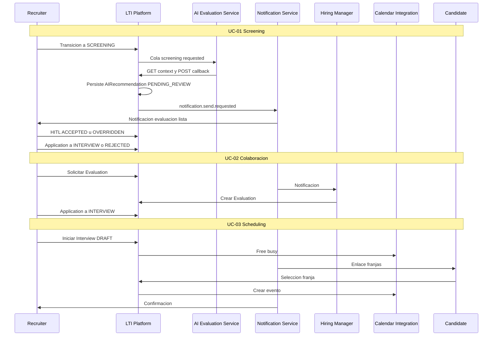

---

# 5. Modelo de Datos

El modelo de datos de LTI está diseñado para **PostgreSQL 15+** en un **backend modular monolítico** (esquema relacional único, migraciones versionadas). Soporta los casos de uso UC-01–UC-03, aislamiento multi-tenant por `organization_id` y workflows asíncronos sin tablas de orquestación adicionales en MVP.

## 5.1 Principios de diseño

| Principio | Decisión MVP |
|-----------|--------------|
| **Multi-tenant** | Toda tabla de negocio incluye `organization_id UUID NOT NULL` con FK a `organization` e índice compuesto `(organization_id, …)` |
| **Sin sobre-normalización** | `Recruiter` y `HiringManager` son **roles de dominio** materializados en `user.role` (sin tablas `recruiter` / `hiring_manager` duplicadas) |
| **Trazabilidad IA** | Histórico de `ai_recommendation` por `application_id` (no sobrescritura; UC-01) |
| **Async screening** | Campos `screening_job_status` y `screening_job_id` en `application` (cola externa; sin entidad `async_job`) |
| **PII y GDPR** | `candidate.consent_*`, soft delete `deleted_at`, `audit_log` append-only |
| **RBAC** | Aplicación en capa API; restricciones de integridad con FKs y UNIQUE; RLS PostgreSQL recomendado en fase post-MVP |

## 5.2 Convenciones físicas (PostgreSQL)

- **PK:** `UUID` generado en aplicación (`gen_random_uuid()` en BD).
- **Timestamps:** `TIMESTAMPTZ` en UTC (`created_at`, `updated_at` donde aplique).
- **Texto libre largo:** `TEXT`; estructuras variables: `JSONB`.
- **Enums:** `CREATE TYPE` nativo o `VARCHAR` con `CHECK` (se documentan como enums lógicos).
- **Naming:** tablas en `snake_case`, singular conceptual / plural físico opcional — aquí **singular** (`application`, `job_offer`).

---

## 5.3 Entidades y atributos

### 5.3.1 `organization` (tenant)

| Atributo | Tipo PostgreSQL | Restricciones | Notas |
|----------|-----------------|---------------|-------|
| `id` | `UUID` | PK | |
| `name` | `VARCHAR(255)` | NOT NULL | |
| `slug` | `VARCHAR(64)` | NOT NULL, UNIQUE | Subdominio o identificador tenant |
| `plan_tier` | `plan_tier_enum` | NOT NULL, DEFAULT `'STARTER'` | `STARTER`, `GROWTH`, `SCALE` (Lean Canvas) |
| `ai_quota_monthly` | `INTEGER` | NOT NULL, DEFAULT 0 | UC-01 / §3.4 |
| `retention_days` | `INTEGER` | NOT NULL, DEFAULT 365 | GDPR por tenant |
| `calendar_provider` | `VARCHAR(32)` | NULL | `GOOGLE`, `MICROSOFT` — UC-03 |
| `created_at` | `TIMESTAMPTZ` | NOT NULL | |

---

### 5.3.2 `user` (agregado: `Recruiter`, `HiringManager`, `Organization Admin`)

Los actores **Recruiter**, **HiringManager** y **Organization Admin** comparten esta tabla; el rol determina permisos RBAC (UC-01 §4.A4, UC-02 §4.B6).

| Atributo | Tipo | Restricciones | Notas |
|----------|------|---------------|-------|
| `id` | `UUID` | PK | |
| `organization_id` | `UUID` | FK → `organization`, NOT NULL | Tenant |
| `idp_subject` | `VARCHAR(255)` | NOT NULL | IdP externo |
| `email` | `VARCHAR(320)` | NOT NULL | |
| `full_name` | `VARCHAR(255)` | NOT NULL | |
| `role` | `user_role_enum` | NOT NULL | `ORG_ADMIN`, `RECRUITER`, `HIRING_MANAGER` |
| `is_active` | `BOOLEAN` | NOT NULL, DEFAULT true | |
| `created_at` | `TIMESTAMPTZ` | NOT NULL | |
| `updated_at` | `TIMESTAMPTZ` | NOT NULL | |

**Índices:** `UNIQUE (organization_id, idp_subject)`; `(organization_id, email)`.

---

### 5.3.3 `candidate`

| Atributo | Tipo | Restricciones | Notas |
|----------|------|---------------|-------|
| `id` | `UUID` | PK | |
| `organization_id` | `UUID` | FK, NOT NULL | |
| `email` | `VARCHAR(320)` | NOT NULL | |
| `full_name` | `VARCHAR(255)` | NOT NULL | |
| `phone` | `VARCHAR(32)` | NULL | |
| `consent_given_at` | `TIMESTAMPTZ` | NOT NULL | UC-01 precondición |
| `consent_version` | `VARCHAR(16)` | NOT NULL | |
| `source` | `VARCHAR(64)` | NULL | Canal de captación |
| `deleted_at` | `TIMESTAMPTZ` | NULL | Derecho al olvido / anonimización |
| `created_at` | `TIMESTAMPTZ` | NOT NULL | |

**Índices:** `UNIQUE (organization_id, email) WHERE deleted_at IS NULL` (parcial, duplicados §3.3).

---

### 5.3.4 `job_offer`

| Atributo | Tipo | Restricciones | Notas |
|----------|------|---------------|-------|
| `id` | `UUID` | PK | |
| `organization_id` | `UUID` | FK, NOT NULL | |
| `title` | `VARCHAR(255)` | NOT NULL | |
| `description` | `TEXT` | NOT NULL | |
| `requirements` | `JSONB` | NOT NULL, DEFAULT '{}' | Criterios screening IA |
| `status` | `job_offer_status_enum` | NOT NULL | `DRAFT`, `ACTIVE`, `CLOSED` |
| `primary_recruiter_id` | `UUID` | FK → `user`, NOT NULL | Propietario operativo |
| `created_at` | `TIMESTAMPTZ` | NOT NULL | |
| `closed_at` | `TIMESTAMPTZ` | NULL | |

**Regla:** `primary_recruiter_id` debe referenciar `user` con `role = 'RECRUITER'` (validación en aplicación).

---

### 5.3.5 `job_offer_hiring_manager` (asignación N:M)

Evita tabla `hiring_manager` redundante; materializa la relación UC-02.

| Atributo | Tipo | Restricciones |
|----------|------|---------------|
| `job_offer_id` | `UUID` | PK, FK → `job_offer` |
| `user_id` | `UUID` | PK, FK → `user` |
| `assigned_at` | `TIMESTAMPTZ` | NOT NULL |

**Índices:** `INDEX (user_id)` para consultas por HM.

---

### 5.3.6 `application`

Entidad central del pipeline; estados alineados con UC-01–UC-03.

| Atributo | Tipo | Restricciones | Notas |
|----------|------|---------------|-------|
| `id` | `UUID` | PK | |
| `organization_id` | `UUID` | FK, NOT NULL | Denormalización tenant para filtros rápidos |
| `job_offer_id` | `UUID` | FK, NOT NULL | |
| `candidate_id` | `UUID` | FK, NOT NULL | |
| `status` | `application_status_enum` | NOT NULL | Ver §5.4 |
| `screening_job_status` | `screening_job_status_enum` | NOT NULL, DEFAULT `'NONE'` | Async UC-01: `NONE`, `QUEUED`, `PROCESSING`, `FAILED`, `COMPLETED` |
| `screening_job_id` | `VARCHAR(64)` | NULL | Correlación con mensaje de cola |
| `created_at` | `TIMESTAMPTZ` | NOT NULL | |
| `updated_at` | `TIMESTAMPTZ` | NOT NULL | |

**Índices:** `UNIQUE (job_offer_id, candidate_id)`; `(organization_id, status)`; `(organization_id, job_offer_id)`.

---

### 5.3.7 `ai_recommendation`

| Atributo | Tipo | Restricciones | Notas |
|----------|------|---------------|-------|
| `id` | `UUID` | PK | |
| `organization_id` | `UUID` | FK, NOT NULL | |
| `application_id` | `UUID` | FK, NOT NULL | |
| `status` | `ai_recommendation_status_enum` | NOT NULL | §5.4 |
| `score` | `NUMERIC(5,2)` | NULL si fallo generación | 0–100 |
| `reasons` | `JSONB` | NOT NULL, DEFAULT '[]' | Factores explicables |
| `evidence` | `JSONB` | NOT NULL, DEFAULT '[]' | Citas CV |
| `model_version` | `VARCHAR(64)` | NOT NULL | |
| `reviewed_by_user_id` | `UUID` | FK → `user`, NULL | HITL: relleno en revisión |
| `reviewed_at` | `TIMESTAMPTZ` | NULL | |
| `override_reason` | `TEXT` | NULL | Obligatorio si `OVERRIDDEN` (CHECK app) |
| `error_code` | `VARCHAR(64)` | NULL | UC-01 alternativos 4.A1–4.A3 |
| `created_at` | `TIMESTAMPTZ` | NOT NULL | |

**Índices:** `(application_id, created_at DESC)`.

**Reglas de transición hacia `INTERVIEW`:** solo si la `ai_recommendation` vigente tiene `status IN ('ACCEPTED','OVERRIDDEN')` y `reviewed_at IS NOT NULL`. Si `status = 'REJECTED'`, la API rechaza `Application` → `INTERVIEW` con **409** (UC-02 §4.B7, NFR-SEC-05).

---

### 5.3.8 `evaluation`

| Atributo | Tipo | Restricciones | Notas |
|----------|------|---------------|-------|
| `id` | `UUID` | PK | |
| `organization_id` | `UUID` | FK, NOT NULL | |
| `application_id` | `UUID` | FK, NOT NULL | |
| `author_user_id` | `UUID` | FK → `user`, NOT NULL | HM en UC-02 |
| `rating` | `SMALLINT` | CHECK (1–5) | Rúbrica simple |
| `recommendation` | `evaluation_recommendation_enum` | NOT NULL | `PROCEED`, `HOLD`, `REJECT` |
| `comment` | `TEXT` | NULL | |
| `created_at` | `TIMESTAMPTZ` | NOT NULL | |

**Índices:** `(application_id)`; `(author_user_id, application_id)` UNIQUE opcional si un HM solo evalúa una vez por postulación.

---

### 5.3.9 `interview`

Estados independientes de `application.status` (UC-03 §nota).

| Atributo | Tipo | Restricciones | Notas |
|----------|------|---------------|-------|
| `id` | `UUID` | PK | |
| `organization_id` | `UUID` | FK, NOT NULL | |
| `application_id` | `UUID` | FK, NOT NULL | |
| `status` | `interview_status_enum` | NOT NULL | `DRAFT`, `SCHEDULED`, `CANCELLED` |
| `interview_type` | `VARCHAR(64)` | NOT NULL | p. ej. `TECHNICAL`, `HR` |
| `duration_minutes` | `SMALLINT` | NOT NULL | |
| `scheduled_start_at` | `TIMESTAMPTZ` | NULL | Obligatorio si `SCHEDULED` |
| `scheduled_end_at` | `TIMESTAMPTZ` | NULL | |
| `timezone` | `VARCHAR(64)` | NOT NULL, DEFAULT `'Europe/Madrid'` | |
| `meeting_url` | `VARCHAR(512)` | NULL | Enlace externo |
| `calendar_event_id` | `VARCHAR(255)` | NULL | Calendar Integration |
| `scheduling_token_hash` | `VARCHAR(128)` | NULL | UC-03 enlace candidato (hash, no token plano) |
| `scheduling_token_expires_at` | `TIMESTAMPTZ` | NULL | TTL 72 h |
| `created_by_user_id` | `UUID` | FK → `user`, NOT NULL | Recruiter |
| `created_at` | `TIMESTAMPTZ` | NOT NULL | |
| `updated_at` | `TIMESTAMPTZ` | NOT NULL | |

---

### 5.3.10 `interview_participant`

| Atributo | Tipo | Restricciones |
|----------|------|---------------|
| `interview_id` | `UUID` | PK, FK → `interview` |
| `user_id` | `UUID` | PK, FK → `user` |
| `participant_role` | `VARCHAR(32)` | NOT NULL | `RECRUITER`, `HIRING_MANAGER` |

---

### 5.3.11 `attachment`

Metadatos en BD; binario en object storage (`storage_key`).

| Atributo | Tipo | Restricciones | Notas |
|----------|------|---------------|-------|
| `id` | `UUID` | PK | |
| `organization_id` | `UUID` | FK, NOT NULL | |
| `candidate_id` | `UUID` | FK, NOT NULL | |
| `application_id` | `UUID` | FK, NULL | CV ligado a postulación |
| `file_name` | `VARCHAR(255)` | NOT NULL | |
| `storage_key` | `VARCHAR(512)` | NOT NULL, UNIQUE | Ruta object storage |
| `mime_type` | `VARCHAR(128)` | NOT NULL | `application/pdf`, etc. |
| `size_bytes` | `BIGINT` | NOT NULL, CHECK (>0) | |
| `uploaded_by` | `attachment_source_enum` | NOT NULL | `CANDIDATE`, `RECRUITER` |
| `created_at` | `TIMESTAMPTZ` | NOT NULL | |

---

### 5.3.12 `notification`

Persistencia de notificaciones emitidas por **Notification Service** (in-app; email se audita igualmente).

| Atributo | Tipo | Restricciones | Notas |
|----------|------|---------------|-------|
| `id` | `UUID` | PK | |
| `organization_id` | `UUID` | FK, NOT NULL | |
| `recipient_user_id` | `UUID` | FK → `user`, NULL | Internos |
| `recipient_candidate_id` | `UUID` | FK → `candidate`, NULL | Externos |
| `channel` | `notification_channel_enum` | NOT NULL | `IN_APP`, `EMAIL` |
| `event_type` | `VARCHAR(64)` | NOT NULL | p. ej. `SCREENING_READY` |
| `payload` | `JSONB` | NOT NULL, DEFAULT '{}' | IDs relacionados |
| `read_at` | `TIMESTAMPTZ` | NULL | Solo in-app |
| `sent_at` | `TIMESTAMPTZ` | NOT NULL | |

**CHECK:** `(recipient_user_id IS NOT NULL) OR (recipient_candidate_id IS NOT NULL)`.

---

### 5.3.13 `audit_log` (append-only)

| Atributo | Tipo | Restricciones | Notas |
|----------|------|---------------|-------|
| `id` | `UUID` | PK | |
| `organization_id` | `UUID` | FK, NOT NULL | |
| `actor_user_id` | `UUID` | FK → `user`, NULL | NULL = sistema |
| `action` | `VARCHAR(64)` | NOT NULL | p. ej. `APPLICATION_STATUS_CHANGED` |
| `entity_type` | `VARCHAR(64)` | NOT NULL | `application`, `ai_recommendation`, … |
| `entity_id` | `UUID` | NOT NULL | |
| `metadata` | `JSONB` | NOT NULL, DEFAULT '{}' | Estados prev/nuevo, IP |
| `created_at` | `TIMESTAMPTZ` | NOT NULL | |

**Índices:** `(organization_id, created_at DESC)`; `(entity_type, entity_id)`.

Sin `UPDATE`/`DELETE` en aplicación (cumplimiento y auditoría).

---

## 5.4 Enumeraciones de dominio

### `application_status_enum`

`NEW` → `SCREENING` → `INTERVIEW` → `OFFER` → `HIRED` | `REJECTED` | `WITHDRAWN`

| Transición | Validación MVP |
|------------|----------------|
| → `SCREENING` | Consentimiento + `attachment`; rol `RECRUITER` |
| → `INTERVIEW` | Última `ai_recommendation` revisada con `status IN ('ACCEPTED','OVERRIDDEN')` y `reviewed_at IS NOT NULL`. **Prohibido** si `status = 'REJECTED'` (409). |
| → `REJECTED` | Acción `RECRUITER` (incluye alineación con `AIRecommendation` = `REJECTED`) |
| → `WITHDRAWN` | Portal candidato o recruiter |

### `ai_recommendation_status_enum`

`PENDING_REVIEW` → `ACCEPTED` | `REJECTED` | `OVERRIDDEN` (terminal tras HITL).

### `screening_job_status_enum` (async UC-01)

| Valor | Significado |
|-------|-------------|
| `NONE` | Sin job encolado |
| `QUEUED` | Mensaje publicado |
| `PROCESSING` | Monolito al servir `GET` contexto (inferencia en curso en AI Service) |
| `FAILED` | 4.A1–4.A3 |
| `COMPLETED` | `ai_recommendation` creada o error registrado |

### `interview_status_enum`

`DRAFT` → `SCHEDULED` | `CANCELLED`

---

## 5.5 Relaciones y cardinalidades

| Relación | Cardinalidad | Implementación |
|----------|--------------|----------------|
| `organization` → `user` | 1:N | FK `user.organization_id` |
| `organization` → `candidate` | 1:N | FK |
| `organization` → `job_offer` | 1:N | FK |
| `job_offer` → `application` | 1:N | FK; UNIQUE `(job_offer_id, candidate_id)` |
| `candidate` → `application` | 1:N | Mismo candidato en varias vacantes |
| `application` → `ai_recommendation` | 1:N | Histórico de ciclos de screening |
| `application` → `evaluation` | 1:N | Varios HM posibles |
| `application` → `interview` | 1:N | Reprogramaciones / múltiples rondas |
| `interview` → `user` (participantes) | N:M | `interview_participant` |
| `job_offer` → `user` (HM) | N:M | `job_offer_hiring_manager` |
| `job_offer` → `user` (recruiter principal) | N:1 | `primary_recruiter_id` |
| `candidate` → `attachment` | 1:N | |
| `application` → `attachment` | 1:N | Opcional FK en `attachment` |
| `user` / `candidate` → `notification` | 1:N | Destinatario polimórfico (dos FKs) |
| `organization` → `audit_log` | 1:N | |

---

## 5.6 RBAC (mapeo lógico, sin tabla extra)

| Rol (`user.role`) | Operaciones representativas en BD vía API |
|-------------------|-------------------------------------------|
| `ORG_ADMIN` | CRUD usuarios tenant, políticas `organization` |
| `RECRUITER` | CRUD `job_offer`, `application`, transiciones estado, HITL `ai_recommendation`, crear `interview` |
| `HIRING_MANAGER` | Leer `application` asignadas, INSERT `evaluation`, participar en `interview_participant` |

Todas las consultas incluyen predicado `WHERE organization_id = :current_tenant` derivado del token IdP.

---

## 5.7 Diagrama entidad-relación (Mermaid)

Diagrama simplificado: actores de dominio `Recruiter` / `HiringManager` como especializaciones de `USER` (misma tabla).

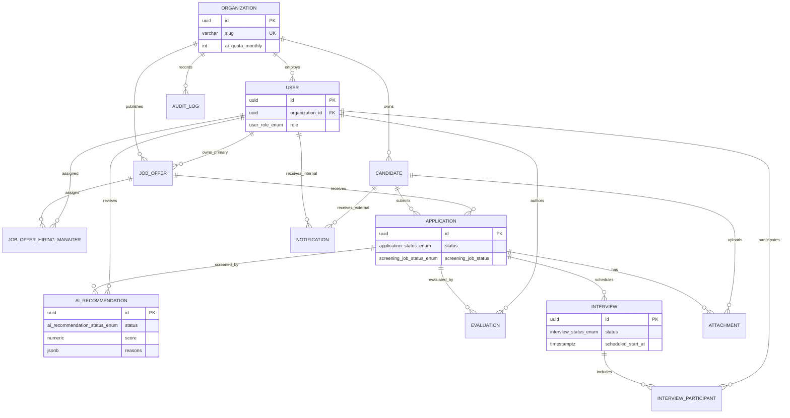

## 5.8 Trazabilidad modelo ↔ casos de uso

| UC | Tablas / campos clave |
|----|----------------------|
| UC-01 | `application.screening_job_*`, `ai_recommendation.*`, `attachment`, `audit_log` |
| UC-02 | `evaluation`, `job_offer_hiring_manager`, regla transición → `INTERVIEW` |
| UC-03 | `interview`, `interview_participant`, `scheduling_token_*`, `organization.calendar_provider` |

## 5.9 Consideraciones de implementación (PostgreSQL)

- **Migraciones:** Flyway/Liquibase en el monolito; enums con `ALTER TYPE ... ADD VALUE` planificado.
- **Integridad:** FK `ON DELETE RESTRICT` en entidades de negocio; `candidate.deleted_at` sin borrado físico en MVP.
- **Rendimiento:** índices compuestos por tenant; partición de `audit_log` por rango de fechas solo si volumen lo exige (post-MVP).
- **Cola async:** no persiste payloads de CV en cola; solo IDs + `screening_job_id`; el **AI Candidate Evaluation Service** obtiene `storage_key` vía API interna y devuelve resultados por **callback**; el **monolito** persiste `ai_recommendation` (§7).

---

# 6. Diseño de Alto Nivel

La arquitectura de LTI prioriza un **modular monolith evolutivo** como núcleo operativo, con **dos servicios desacoplados** únicamente donde el acoplamiento penaliza latencia, escalado independiente o blast radius: **AI Candidate Evaluation Service** y **Notification Service**. El diseño es **cloud-native**, desplegable por un equipo pequeño (2–3 ingenieros) y coherente con el modelo PostgreSQL (§5) y los casos de uso UC-01–UC-03.

**Explícitamente fuera de alcance MVP:** microservicios por dominio, service mesh, Kafka, event sourcing, CQRS, orquestación Kubernetes multi-cluster.

---

## 6.1 Vista general de componentes

| Componente | Tipo | Responsabilidad principal |
|------------|------|---------------------------|
| **Web App (SPA)** | Frontend | UI recruiter/HM/admin; portal candidato limitado |
| **LTI API Monolith** | Backend núcleo | REST, RBAC, reglas de dominio, transacciones PostgreSQL, publicación de eventos |
| **AI Candidate Evaluation Service** | Servicio desacoplado | Consumo async; `GET` contexto → inferencia → `POST` callback; **sin** escritura en PostgreSQL |
| **Notification Service** | Servicio desacoplado | Consumo de eventos; email + persistencia `notification` in-app |
| **PostgreSQL** | Persistencia | Fuente de verdad relacional multi-tenant |
| **Object Storage** | Ficheros | CV y adjuntos (`attachment.storage_key`) |
| **OpenSearch** | Búsqueda | Índice full-text (§3.8); consistencia eventual |
| **Message Queue** | Mensajería | Cola gestionada (p. ej. AWS SQS / Azure Queue / Redis Streams) |
| **Identity Provider (IdP)** | Externo | Autenticación OIDC; emisión JWT |
| **LLM / Embedding Provider** | Externo | API de inferencia (OpenAI, Azure OpenAI, etc.) |
| **Email Provider** | Externo | SES, SendGrid, etc. (vía Notification Service) |
| **Calendar APIs** | Externo | Google Calendar / Microsoft Graph (módulo dentro del monolito) |
| **Observability Stack** | Plataforma | Logs, métricas, trazas (CloudWatch + OpenTelemetry o equivalente) |

---

## 6.2 LTI API Monolith — límites y módulos internos

El monolito es un **único despliegue** (contenedor Docker) con **módulos de código** separados por dominio, no por servicio de red.

```text
lti-api/
├── api/              # Controllers REST, DTOs, validación entrada
├── auth/             # JWT validation, tenant context, RBAC guards
├── tenant/           # organization, users
├── jobs/             # job_offer, asignaciones HM
├── candidates/       # candidate, consent GDPR
├── applications/     # application, transiciones estado, screening trigger
├── evaluations/      # evaluation (UC-02)
├── interviews/       # interview, scheduling, calendar adapter
├── attachments/      # metadatos + presigned URLs object storage
├── audit/            # audit_log append
├── search/           # cliente OpenSearch + publicación eventos indexación
├── messaging/        # publicadores a cola (screening, notification, index)
└── copilot/          # invocación síncrona LLM (§3.11), timeout corto
```

### Responsabilidades dentro del monolito

| Módulo | Responsabilidad | Persistencia / externos |
|--------|-----------------|-------------------------|
| **api + auth** | Exponer REST; validar JWT IdP; resolver `organization_id`; aplicar RBAC §5.6 | — |
| **applications** | CRUD pipeline; HITL `ai_recommendation`; `screening_job_status`; UC-01/02 | PostgreSQL |
| **attachments** | Registrar metadatos; generar URL firmada subida/descarga; validar MIME/tamaño | Object Storage + PostgreSQL |
| **interviews** | UC-03; tokens scheduling; orquestar Calendar Integration | PostgreSQL + APIs calendario |
| **search** | Tras commit transaccional, publicar `entity.index.requested` | OpenSearch (async) |
| **messaging** | Publicar mensajes tipados; idempotencia por `message_id` | Cola gestionada |
| **audit** | Insertar `audit_log` en operaciones sensibles | PostgreSQL |
| **copilot** | Llamadas LLM síncronas bajo demanda; no cambia estados | LLM Provider |

### Límite del monolito (qué NO hace)

- **No ejecuta** inferencia pesada de screening (delegado al AI Service).
- **No envía** email directamente (delegado al Notification Service).
- **No almacena** binarios de CV en PostgreSQL ni en disco local del contenedor.
- **No reemplaza** al IdP en gestión de credenciales.

Todo lo demás del MVP — reglas de negocio, RBAC, scheduling, copiloto, API candidato — permanece en el monolito para minimizar superficie operativa.

---

## 6.3 Servicios desacoplados (solo dos)

### 6.3.1 AI Candidate Evaluation Service

| Aspecto | Diseño |
|---------|--------|
| **Responsabilidad** | Consumir `application.screening.requested`; `GET` contexto interno; leer `attachment` en object storage; invocar LLM; `POST` callback con DTO de resultado |
| **Persistencia** | **Ninguna en el AI Service.** Solo el monolito persiste `ai_recommendation`, actualiza `screening_job_status` y publica `notification.send.requested` tras el callback (§7) |
| **Escalado** | Réplicas de worker según profundidad de cola; sin estado en memoria |
| **Seguridad** | IAM/credencial de red privada; sin exposición pública; sin PII en logs |

### 6.3.2 Notification Service

| Aspecto | Diseño |
|---------|--------|
| **Responsabilidad** | Consumir eventos (`notification.send.requested`); renderizar plantillas; enviar email; insertar filas `notification` |
| **Persistencia** | PostgreSQL (`notification`) + proveedor email |
| **Escalado** | Horizontal ligero; cola dedicada separada de screening |
| **Razonamiento desacople** | Aislar fallos de proveedor email y reintentos sin bloquear API principal |

---

## 6.4 Patrones de comunicación

| Patrón | Uso | Ejemplo |
|--------|-----|---------|
| **REST síncrono** | Cliente ↔ monolito; monolito ↔ IdP (validación JWT local con JWKS cache) | `PATCH /applications/{id}/status` |
| **Cola async (fire-and-forget)** | Monolito → AI / Notification / Indexer | Tras commit TX: publicar mensaje |
| **Polling / SSE (opcional MVP)** | UI espera screening | GET `/applications/{id}` con `screening_job_status` (polling 3–5 s) |
| **Presigned URL** | Subida/descarga attachments | Cliente ↔ object storage directo |
**No se usa** comunicación sync monolito→AI para screening (evita timeouts HTTP y acoplamiento temporal). El AI Service **no** publica en cola ni notificaciones.

### Catálogo de eventos (mensajes) MVP

| Evento | Productor | Consumidor | Payload mínimo |
|--------|-----------|------------|----------------|
| `application.screening.requested` | Monolito | AI Service | `organization_id`, `application_id`, `screening_job_id` |
| `notification.send.requested` | Monolito | Notification Service | `event_type`, destinatarios, `payload` |
| `entity.index.requested` | Monolito | Worker indexación (monolito) | `entity_type`, `entity_id`, `organization_id` |

Cola única con **dead-letter queue (DLQ)** por tipo de mensaje o prefijos de cola separados (`lti-screening`, `lti-notifications`, `lti-index`) — sin broker Kafka.

---

## 6.5 Diagrama de arquitectura de alto nivel

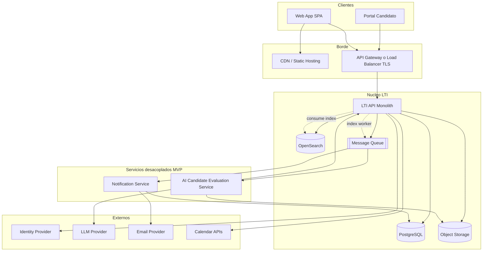

---

## 6.6 Flujo completo: screening asíncrono (UC-01)

Correlación con `screening_job_id` y estados §5.4.

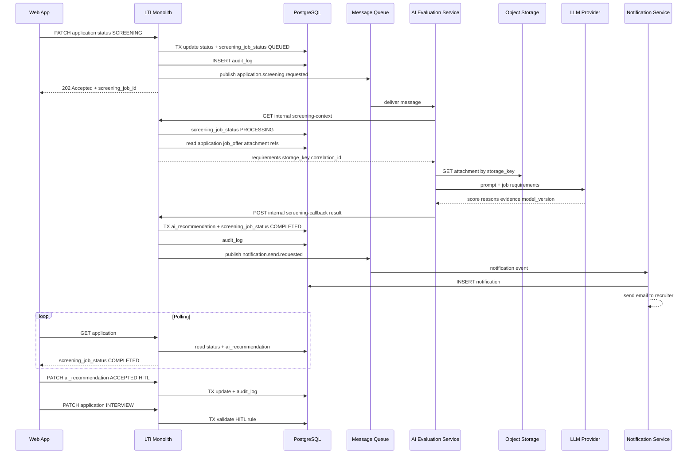

**Puntos de fallo (UC-01 alternativos):** si LLM o parsing fallan, AI Service invoca callback con `success: false` y `error_code`; el monolito persiste `screening_job_status FAILED` y dispara notificación — sin bloqueo del monolito.

---

## 6.7 Interacción frontend — backend — IA

| Capa | Comportamiento |
|------|----------------|
| **Frontend** | No llama al LLM ni al AI Service directamente. Token JWT solo para monolito. |
| **Monolito** | Orquesta permisos; para copiloto §3.11 llama LLM **síncrono** con timeout (p. ej. 15 s) y rate limit por tenant. |
| **AI Service** | Solo consumidor de cola; cliente HTTP interno: `GET` contexto → inferencia → `POST` callback al monolito (mTLS). Sin endpoints públicos. |

La UI de screening muestra `ai_recommendation.reasons` y `evidence` (JSONB) como texto estructurado; botones HITL llaman REST al monolito, nunca auto-aceptan por score.

---

## 6.8 Manejo de `Attachment`

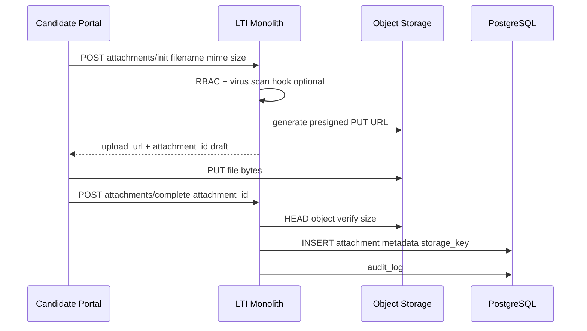

- Descarga recruiter: `GET attachments/{id}/download` → URL firmada lectura TTL corto.
- AI Service lee vía **mismo bucket** con rol IAM restringido al prefijo `{organization_id}/`.
- GDPR: borrado lógico `candidate.deleted_at` + job de purga object storage (monolito scheduler, no microservicio).

---

## 6.9 Flujo de indexación y búsqueda

| Paso | Componente | Acción |
|------|------------|--------|
| 1 | Monolito | Tras INSERT/UPDATE `candidate`, `application`, `job_offer`, commit TX |
| 2 | Monolito | Publica `entity.index.requested` |
| 3 | Worker indexación (proceso lado monolito) | Consume cola; lee entidad; extrae texto CV si aplica |
| 4 | OpenSearch | Upsert documento con `organization_id` obligatorio en filtro |
| 5 | Monolito | `GET /search?q=` aplica `bool` filter `organization_id` + query |

**Consistencia:** eventual (segundos). La UI de búsqueda §3.8 no depende del índice para operaciones críticas del pipeline (siempre PostgreSQL por ID).

---

## 6.10 Autenticación y autorización

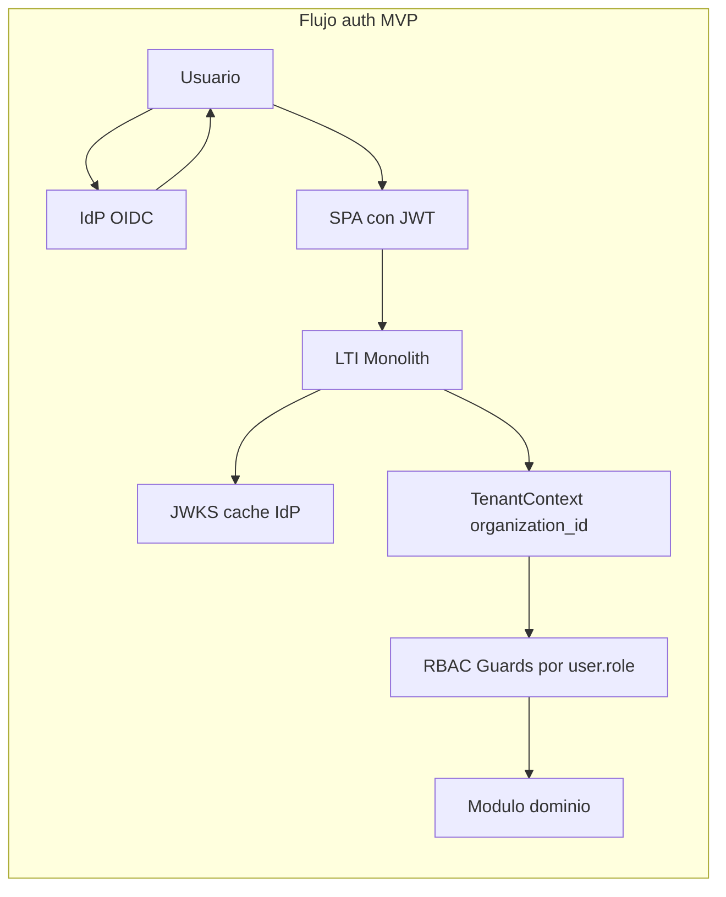

| Capa | Implementación |
|------|----------------|
| **Autenticación** | OIDC Authorization Code + PKCE (SPA); IdP emite JWT con `sub`, `email` |
| **Mapeo tenant** | Monolito resuelve `user` por `(organization_id, idp_subject)` |
| **Autorización** | Guards por ruta: recruiter-only para HITL y transiciones; HM solo `job_offer_hiring_manager` |
| **Portal candidato** | Token opaco/hash en `interview.scheduling_token_hash` o sesión limitada post-magic-link; sin JWT IdP |
| **GDPR** | Consentimiento verificado antes de `SCREENING`; `audit_log` en lectura CV |

Secrets en **Parameter Store / Secrets Manager**; nunca en imagen Docker.

---

## 6.11 Calendar Integration (dentro del monolito)

- Módulo **interviews** encapsula adaptador Google/Microsoft.
- Tokens OAuth de calendario por `user` interno: campo opcional `user.calendar_oauth_encrypted` (`JSONB` cifrado) en MVP, sin tabla adicional (UC-03).

---

## 6.12 Observabilidad

| Pilar | Herramienta MVP | Uso |
|-------|-----------------|-----|
| **Logs** | JSON estructurado → CloudWatch / Loki | `correlation_id`, `organization_id`, `screening_job_id` |
| **Métricas** | Prometheus-compatible o CloudWatch Metrics | Latencia API, profundidad cola, tasa `FAILED` screening |
| **Trazas** | OpenTelemetry → backend managed | Span REST + consume cola + llamada LLM |
| **Alertas** | Umbrales simples | DLQ > 0, error rate 5xx, cuota IA agotada |

Sin service mesh: correlación propagada por header `X-Correlation-Id` desde SPA.

---

## 6.13 Seguridad y escalabilidad (consideraciones MVP)

| Tema | Decisión pragmática |
|------|---------------------|
| **Red** | Monolito y workers en VPC privada; solo ALB público |
| **TLS** | Terminación en load balancer |
| **Multi-tenant** | Filtro `organization_id` obligatorio en código + tests contractuales |
| **Datos** | Cifrado reposo RDS + S3; backups RDS automáticos |
| **Escalado monolito** | 2–4 instancias stateless detrás de ALB |
| **Escalado AI** | Workers según longitud cola screening |
| **Escalado OpenSearch** | Un nodo pequeño MVP; escalar vertical primero |
| **Rate limiting** | API Gateway o middleware por `organization_id` |

---

## 6.14 Despliegue cloud-native (sin overengineering)

| Entorno MVP | Opción recomendada |
|-------------|-------------------|
| **Compute** | 1 task definition ECS Fargate (monolito) + 1 task AI + 1 task Notification |
| **BD** | RDS PostgreSQL Multi-AZ pequeño |
| **Cola** | SQS estándar + DLQ |
| **Storage** | S3 bucket por entorno con prefijos tenant |
| **Frontend** | S3 + CloudFront o Vercel |
| **IaC** | Terraform módulos mínimos (VPC, RDS, S3, SQS, ECS) |

Docker Compose en local para desarrollo; mismos contenedores que producción.

---

## 6.15 Matriz componente ↔ caso de uso

| UC | Componentes involucrados |
|----|--------------------------|
| UC-01 | SPA, Monolito, Queue, AI Service, PostgreSQL, S3, LLM, Notification Service |
| UC-02 | SPA, Monolito, PostgreSQL, Notification Service |
| UC-03 | SPA, Portal, Monolito, Calendar APIs, PostgreSQL, Notification Service |

---

# 7. Modelo C4 — AI Candidate Evaluation Service

Este capítulo documenta **únicamente** el sistema software **AI Candidate Evaluation Service**, usando el modelo C4 en tres niveles **separados y progresivos**. No describe despliegue cloud, ni dominio completo de LTI, ni infraestructura global (véase §6).

**Patrón de integración definitivo (MVP):** el servicio **no accede a PostgreSQL**. Obtiene contexto mínimo vía **API interna del monolito**, ejecuta inferencia y devuelve resultados mediante **callback API**; el monolito persiste `ai_recommendation`, actualiza `application.screening_job_status`, escribe `audit_log` y publica `notification.send.requested`. El **HITL** ocurre siempre en el monolito/UI (UC-01), fuera del límite de este sistema.

---

## 7.1 Nivel 1 — Diagrama de contexto

**Pregunta que responde:** ¿Con qué sistemas externos interactúa el AI Candidate Evaluation Service y quién lo dispara?

**Alcance del diagrama:** solo el sistema en estudio (caja central) y sus vecinos. Sin contenedores internos ni tecnologías.

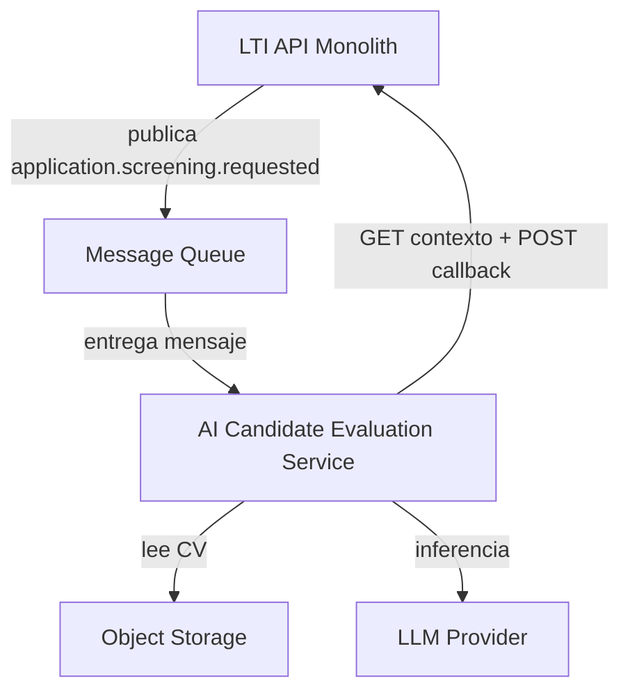

### Responsabilidades en contexto

| Elemento | Rol |
|----------|-----|
| **AI Candidate Evaluation Service** | Evaluar ajuste CV ↔ requisitos de `JobOffer` de forma asíncrona; producir resultado estructurado explicable; **no** decidir contratación ni persistir datos de negocio |
| **LTI API Monolith** | Orquestador: encola screening, expone API interna, persiste modelo §5, aplica cuotas `organization.ai_quota_monthly`, dispara notificaciones |
| **Message Queue** | Desacoplar picos de carga; mensaje sin PII (solo IDs + `screening_job_id`) |
| **Object Storage** | Almacén binario del `Attachment` (CV) |
| **LLM Provider** | Generación de score, razones y evidencia (API externa) |

### Límites explícitos

- El **Recruiter** no interactúa con este sistema; lo hace vía monolito (HITL posterior).
- **Notification Service**, **OpenSearch** e **IdP** quedan **fuera** del contexto de este servicio.

---

## 7.2 Nivel 2 — Diagrama de contenedores

**Pregunta que responde:** ¿Qué contenedores (unidades desplegables / ejecutables) componen el servicio y cómo se comunican con vecinos?

**Alcance:** un contenedor dentro del boundary del sistema + contenedores/sistemas externos con los que habla. Sin módulos de código.

### 7.2.1 Boundary del sistema

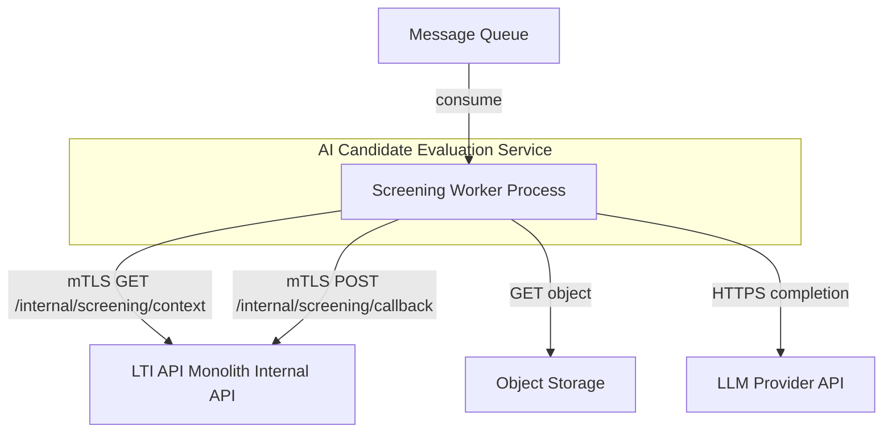

### Tabla de contenedores

| Contenedor | Tecnología MVP | Responsabilidad |
|------------|----------------|-----------------|
| **Screening Worker Process** | Contenedor Docker (Python o Node worker) | Ciclo de vida del job de screening: consumir cola, orquestar inferencia, invocar callback |
| **Message Queue** *(externo)* | Cola gestionada | Buffer de trabajos `application.screening.requested` |
| **LTI API Monolith — Internal API** *(externo)* | REST sobre monolito | Fuente de verdad: contexto de screening y persistencia vía callback |
| **Object Storage** *(externo)* | Bucket S3-compatible | Lectura de CV por `storage_key` |
| **LLM Provider API** *(externo)* | API comercial | Inferencia y embeddings |

**Un solo contenedor** dentro del servicio en MVP — sin dividir en múltiples microservicios.

---

## 7.3 Nivel 3 — Diagrama de componentes

**Pregunta que responde:** ¿Cómo se estructura el código **dentro** del Screening Worker Process?

**Alcance:** componentes lógicos (módulos) y sus dependencias. Sin nombres de instancias cloud, sin tablas SQL (persistencia ajena).

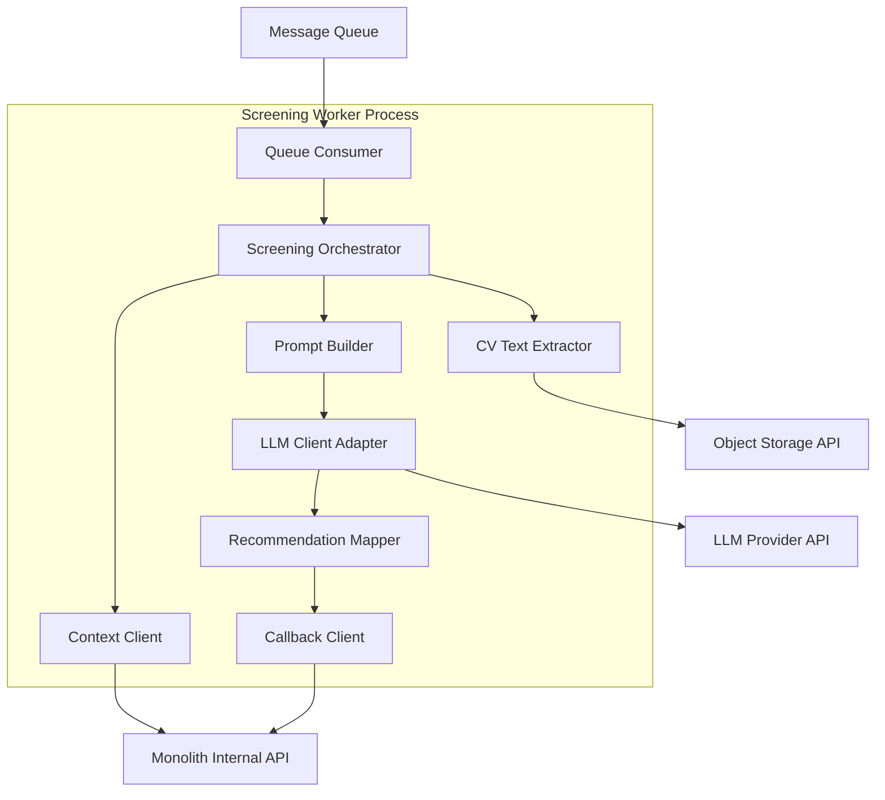

### Componentes internos

| Componente | Responsabilidad | Dependencias |
|------------|-----------------|--------------|
| **Queue Consumer** | Deserializar mensaje; validar `organization_id`, `application_id`, `screening_job_id`; idempotencia por `screening_job_id` | Cola |
| **Screening Orchestrator** | Coordinar pasos UC-01; manejar reintentos; timeouts; no loguear texto de CV | Resto de componentes |
| **Context Client** | `GET /internal/v1/screening/{applicationId}/context` — obtiene `requirements` (JSON), `storage_key`, `mime_type`, cuota IA vigente | Monolith API |
| **CV Text Extractor** | Descarga objeto y extrae texto (PDF/DOC); errores → callback `success: false`, `error_code: CV_PARSE_FAILED` | Object Storage |
| **Prompt Builder** | Construye prompt con criterios + texto CV (minimizado); fija `model_version` | — |
| **LLM Client Adapter** | Abstrae proveedor; aplica timeout; rate limit; no almacena prompts en disco | LLM Provider |
| **Recommendation Mapper** | Transforma respuesta LLM a DTO: `score`, `reasons[]`, `evidence[]` alineado a §5.3.7 | — |
| **Callback Client** | `POST /internal/v1/screening/callback` con resultado o error; header `X-Correlation-Id` | Monolith API |

---

## 7.4 APIs internas (contrato monolito ↔ servicio)

Autenticación: **mTLS + API key rotativa** o JWT de servicio; solo red privada. Sin exposición pública.

### `GET /internal/v1/screening/{applicationId}/context`

**Request headers:** `X-Organization-Id`, `X-Screening-Job-Id`, `X-Correlation-Id`

**Response 200 (ejemplo lógico):**

```json
{
  "application_id": "uuid",
  "organization_id": "uuid",
  "job_requirements": { "mandatory": [], "optional": [] },
  "attachment": { "storage_key": "org/uuid/cv.pdf", "mime_type": "application/pdf" },
  "model_policy": { "max_tokens": 4096, "temperature": 0.2 }
}
```

**Errores:** `404` (application inválida), `409` (consentimiento ausente), `402` (cuota IA agotada) — el worker ack y no reintenta.

### `POST /internal/v1/screening/callback`

**Body éxito:**

```json
{
  "screening_job_id": "string",
  "application_id": "uuid",
  "organization_id": "uuid",
  "success": true,
  "recommendation": {
    "score": 78.5,
    "reasons": [{ "factor": "experience", "weight": 0.4, "note": "..." }],
    "evidence": [{ "quote": "...", "source": "cv" }],
    "model_version": "gpt-4o-2026-05"
  }
}
```

**Body fallo (UC-01 4.A1–4.A3):**

```json
{
  "screening_job_id": "string",
  "application_id": "uuid",
  "organization_id": "uuid",
  "success": false,
  "error_code": "LLM_TIMEOUT"
}
```

**Efecto en monolito (transacción única):**

| `success` | Acción PostgreSQL |
|-----------|-------------------|
| `true` | `INSERT ai_recommendation` (`PENDING_REVIEW`); `screening_job_status = COMPLETED` |
| `false` | `screening_job_status = FAILED`; opcional sin fila IA; `audit_log` |

Tras commit: monolito publica `notification.send.requested` (fuera del AI Service).

---

## 7.5 Flujo de inferencia asíncrono (detalle)

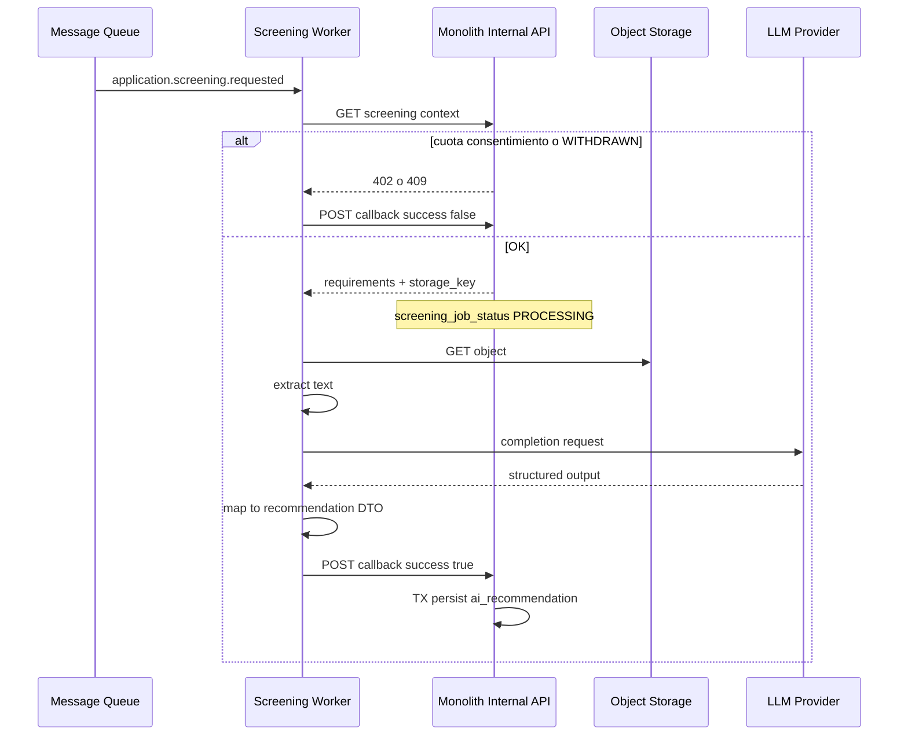

**HITL (fuera del servicio):** el monolito deja `ai_recommendation.status = PENDING_REVIEW` hasta acción del `Recruiter` (`ACCEPTED` \| `REJECTED` \| `OVERRIDDEN`).

---

## 7.6 Seguridad y minimización de PII

| Medida | Implementación |
|--------|----------------|
| **Mensaje de cola** | Solo UUIDs + `screening_job_id`; sin email ni nombre de candidato |
| **Logs del worker** | `correlation_id`, IDs, duración, `error_code`; **prohibido** loguear CV o respuesta LLM completa |
| **Object Storage** | IAM rol lectura `s3:GetObject` prefijo `{organization_id}/*` |
| **Callback** | Validación `organization_id` coherente con contexto; rechazo si `screening_job_id` no coincide |
| **Retención** | El worker no persiste copias de CV; memoria efímera durante job |
| **GDPR** | El monolito ya verificó consentimiento antes de encolar (UC-01 precondición) |

---

## 7.7 Dependencias mínimas (resumen)

| Dependencia | ¿Imprescindible? | Motivo |
|-------------|------------------|--------|
| Message Queue | Sí | Disparo async UC-01 |
| Monolith Internal API | Sí | Contexto + callback (fuente de verdad §5) |
| Object Storage | Sí | Lectura CV |
| LLM Provider | Sí | Inferencia |
| PostgreSQL | **No** | Deliberadamente excluido del servicio |
| Notification Service | **No** | Monolito publica tras callback |

---

## 7.8 Escalabilidad y fallos (solo comportamiento del servicio)

- **Escalado horizontal:** N réplicas del Screening Worker Process consumiendo la misma cola (competing consumers).
- **Idempotencia:** si el callback ya procesó `screening_job_id`, monolito responde `200` sin duplicar `ai_recommendation`.
- **Reintentos:** errores transitorios LLM/S3 — backoff exponencial (máx. 2); errores 4xx de contexto — sin reintento.
- **DLQ:** mensajes fallidos tras N intentos para operación manual.

---

# 8. Stack Tecnológico

El stack de LTI está seleccionado para un **MVP SaaS multi-tenant** operado por un **equipo pequeño (2–3 ingenieros)**, alineado con la arquitectura de §6 (monolito modular, SQS, OpenSearch, S3, callback AI Service, ECS Fargate, PostgreSQL) y con mercado **UE/GDPR**.

**Principio rector:** una tecnología por problema; ecosistemas maduros; evolución sin reescritura del núcleo.

---

## 8.1 Vista resumida del stack

| Capa | Tecnología elegida | Versión orientativa |
|------|-------------------|---------------------|
| **Frontend** | React + TypeScript + Vite | React 18+, TS 5+ |
| **UI** | shadcn/ui + Tailwind CSS | — |
| **API Monolith** | NestJS (Node.js LTS) | Node 20 LTS, NestJS 10+ |
| **ORM / migraciones** | Prisma | Prisma 5+ |
| **AI Candidate Evaluation Service** | Python worker | Python 3.12 |
| **Notification Service** | NestJS worker (mismo monorepo) | Comparte tooling con monolito |
| **Base de datos** | PostgreSQL (Amazon RDS) | PostgreSQL 15+ |
| **Búsqueda** | Amazon OpenSearch Service | OpenSearch 2.x |
| **Object storage** | Amazon S3 | — |
| **Cola async** | Amazon SQS (+ DLQ) | — |
| **Compute** | Amazon ECS Fargate | — |
| **Autenticación** | Auth0 (OIDC) | — |
| **IA / LLM** | Azure OpenAI Service | API compatible OpenAI |
| **Email** | Amazon SES | — |
| **CI/CD** | GitHub Actions | — |
| **IaC** | Terraform | 1.6+ |
| **Observabilidad** | CloudWatch + OpenTelemetry; Sentry (errores app) | — |

---

## 8.2 Frontend

| Tecnología | Justificación | Tradeoffs |
|------------|---------------|-----------|
| **React + TypeScript** | Ecosistema maduro; tipado compartible con contratos API; fácil contratar perfil full-stack | Más boilerplate que frameworks opinionados; mitigado con Vite |
| **Vite** | Build rápido en desarrollo; configuración mínima; ideal SPA recruiter/HM | SSR limitado — aceptable: portal candidato es subconjunto de rutas, no requiere Next.js en MVP |
| **TanStack Query** | Cache y polling de `screening_job_status` (UC-01) sin complejidad de Redux | Curva ligera; suficiente para MVP |
| **shadcn/ui + Tailwind** | UI profesional rápida; accesibilidad razonable; sin licencias | Menos «marca» propia que design system custom — suficiente para MVP |

**Descartado en MVP:** Next.js (SSR innecesario), Angular (peso), micro-frontends.

**Implicaciones de escalabilidad:** assets estáticos en S3 + CloudFront; API stateless escala independiente.

---

## 8.3 Backend — LTI API Monolith

| Tecnología | Justificación | Tradeoffs |
|------------|---------------|-----------|
| **NestJS (Node.js 20 LTS)** | Módulos alineados con §6.2 (`applications`, `interviews`, …); guards RBAC; inyección de dependencias; un lenguaje con frontend | Python podría unificar con AI worker, pero divide especialización; Node excelente para I/O REST y colas |
| **Prisma** | Migraciones declarativas; tipos generados; productividad alta en equipo pequeño | Menos control SQL fino que Flyway puro — aceptable en MVP; raw queries para informes si hiciera falta |
| **class-validator / DTOs** | Validación REST coherente con GDPR y enums §5.4 | — |

**Patrones:** API REST pública + **Internal API** mTLS para callback §7.4; publicación SQS tras `transaction` commit (outbox ligero opcional: tabla `outbox_event` solo si se detectan pérdidas — no obligatorio en MVP).

**Descartado:** Java Spring (más pesado operativamente para 2 devs), GraphQL (complejidad cliente), microservicios Nest separados por dominio.

---

## 8.4 AI Candidate Evaluation Service

| Tecnología | Justificación | Tradeoffs |
|------------|---------------|-----------|
| **Python 3.12 (worker)** | Librerías maduras extracción PDF (`pymupdf` / `pdfplumber`); SDKs LLM; ecosistema ML/IA | Segundo runtime en operaciones — justificado: frontera clara del servicio desacoplado |
| **boto3 (SQS, S3)** | Alineado con AWS §6.14 | Acoplamiento AWS moderado — mitigado con interfaces si se cambia cola/storage |
| **httpx** | Cliente async para `GET context` / `POST callback` al monolito | — |
| **OpenAI Python SDK** | Compatible con Azure OpenAI endpoint | Cambio de proveedor vía variables de entorno + adapter |

**Sin FastAPI HTTP público en MVP:** proceso long-running que consume SQS (menos superficie de ataque).

**Descartado:** LangChain pesado en MVP (orquestación simple en código propio); fine-tuning propio.

---

## 8.5 Notification Service

| Tecnología | Justificación | Tradeoffs |
|------------|---------------|-----------|
| **NestJS worker (paquete en monorepo)** | Reutiliza plantillas, tipos de eventos y configuración; despliegue ECS separado | Mismo stack que monolito — equipo no aprende segundo framework |
| **Amazon SES** | Integración nativa AWS; coste bajo; cumplimiento email transaccional | Plantillas menos «marketing» que SendGrid — suficiente para notificaciones operativas |
| **Prisma (lectura/escritura `notification`)** | Mismo esquema que monolito; evita duplicar modelos | Requiere disciplina de migraciones compartidas en monorepo |

**Descartado:** servicio SaaS email adicional en MVP (SendGrid) salvo problema de deliverability en producción.

---

## 8.6 Datos, búsqueda y ficheros

| Tecnología | Justificación | Tradeoffs |
|------------|---------------|-----------|
| **PostgreSQL (RDS)** | Modelo relacional §5; ACID para transiciones `Application` y callback; herramientas conocidas | Escalado vertical primero; réplica lectura post-MVP si informes cargan |
| **Amazon OpenSearch Service** | Full-text §3.8; filtros por `organization_id`; managed (sin operar cluster) | Coste fijo mayor que PostgreSQL `tsvector` — justificado por UX búsqueda recruiter |
| **Amazon S3** | `Attachment` binarios; presigned URLs §6.8; prefijo por tenant | Vendor AWS — estándar de facto; abstracción `StoragePort` en código |

**Descartado en MVP:** Elasticsearch self-hosted, DynamoDB (modelo relacional ya definido), CDN para CV (no público).

---

## 8.7 Mensajería y compute

| Tecnología | Justificación | Tradeoffs |
|------------|---------------|-----------|
| **Amazon SQS + DLQ** | Async UC-01 §6.4; operación trivial; pago por uso; sin broker Kafka | Orden no garantizado global — aceptable; idempotencia por `screening_job_id` |
| **Amazon ECS Fargate** | Contenedores Docker §6.14 sin gestionar EC2/Kubernetes; 3 servicios (monolito, AI, notification) | Menos portable que K8s — roadmap: extraer servicios sin cambiar imágenes |
| **Amazon ECR** | Registro imágenes CI/CD | — |

**Descartado:** Kafka, RabbitMQ self-hosted, Kubernetes EKS, Lambda para screening (timeouts y cold start inadecuados para PDF+LLM).

---

## 8.8 Cloud provider

| Decisión | Justificación | Tradeoffs |
|----------|---------------|-----------|
| **AWS (región UE, p. ej. `eu-west-1`)** | Cohesión: RDS, S3, SQS, ECS, SES, OpenSearch en un proveedor; facturación única | Lock-in moderado — mitigado con puertos (`StoragePort`, `QueuePort`, `LlmPort`) |
| **Terraform** | IaC reproducible; módulos pequeños; estándar mercado | Curva inicial — una persona del equipo mantiene módulos base |

**Descartado MVP:** multi-cloud, serverless-only, PaaS tipo Heroku (menos control OpenSearch/región UE).

---

## 8.9 Autenticación

| Tecnología | Justificación | Tradeoffs |
|------------|---------------|-----------|
| **Auth0 (OIDC)** | Login social/enterprise; MFA; **Universal Login** acelera MVP; JWT estándar | Coste por MAU vs Cognito; mitigación: plan B2B startup |
| **JWT validation (JWKS)** en NestJS | Sin sesión servidor; monolito stateless §6.13 | Revocación: tokens cortos + refresh controlado por Auth0 |

**Descartado:** auth custom (riesgo seguridad), Cognito (UX B2B más rígida para MVP internacional).

**Portal candidato:** tokens propios del monolito (no Auth0) — §6.10.

---

## 8.10 Proveedor de IA

| Tecnología | Justificación | Tradeoffs |
|------------|---------------|-----------|
| **Azure OpenAI Service** | Residencia datos UE; API compatible OpenAI; adecuado GDPR y clientes europeos | Dependencia Microsoft; mitigación: capa `LlmPort` con implementación `OpenAI` directa alternativa |
| **Modelos MVP** | `gpt-4o-mini` screening (coste); `gpt-4o` copiloto bajo demanda §3.11 | Coste variable — controlado con `ai_quota_monthly` §5.3.1 |

**Descartado:** modelos open-source self-hosted en MVP (CAPEX GPU), entrenamiento custom.

---

## 8.11 CI/CD, calidad y monorepo

| Tecnología | Justificación | Tradeoffs |
|------------|---------------|-----------|
| **GitHub Actions** | Integración nativa si repo en GitHub; pipelines Docker → ECR → ECS | — |
| **Monorepo (pnpm workspaces)** | `apps/api`, `apps/web`, `apps/ai-worker`, `apps/notification-worker`, `packages/shared` | Repo más grande — ganancia: tipos compartidos y un PR |
| **Docker Compose (local)** | Paridad dev con PostgreSQL, LocalStack o ElasticMQ opcional, MinIO opcional | No replica OpenSearch managed — docker single-node OpenSearch en dev |

**Pipeline MVP:** lint + unit tests + build imagen + deploy `staging` manual approval → `prod`.

**Descartado:** Jenkins, GitLab duplicado, ArgoCD (sin K8s).

---

## 8.12 Observabilidad

| Tecnología | Justificación | Tradeoffs |
|------------|---------------|-----------|
| **CloudWatch Logs + Metrics** | Integración cero-config con ECS; retención configurable | Consultas menos ergonómicas que Datadog — suficiente MVP |
| **OpenTelemetry (SDK)** | Trazas REST, SQS consume, LLM call; export a X-Ray o OTLP | Configuración inicial — una vez por servicio |
| **Sentry** | Errores frontend + API con contexto `organization_id` (sin PII CV) | SaaS adicional — plan free/starter |

**Descartado:** stack ELK self-hosted, Prometheus+Grafana completo en MVP (overhead operativo).

---

## 8.13 Matriz de alineación stack ↔ arquitectura

| Decisión arquitectónica (§6–§7) | Tecnología que la materializa |
|--------------------------------|------------------------------|
| Modular monolith | NestJS módulos + Prisma |
| Callback AI Service | Python worker + httpx → Internal API |
| Async screening | SQS + ECS task AI |
| Notificaciones desacopladas | NestJS worker + SES + SQS |
| Multi-tenant PostgreSQL | RDS PostgreSQL + Prisma `organization_id` |
| Búsqueda | OpenSearch Service |
| Attachments | S3 presigned |
| HITL / RBAC | NestJS Guards + Auth0 JWT |
| GDPR / UE | Auth0 EU tenant + Azure OpenAI EU + región AWS UE |

---

## 8.14 Roadmap evolutivo del stack (sin ruptura)

| Fase | Evolución | Disparador |
|------|-----------|------------|
| **MVP** | Stack actual | Lanzamiento primeros tenants |
| **Growth** | Réplica lectura RDS; Redis cache sesión/rate limit; más tareas Fargate | Latencia API > objetivo |
| **Scale** | RLS PostgreSQL; OpenSearch multi-AZ; cola prioritaria screening | >100 tenants o auditoría enterprise |
| **Opcional** | Migrar AI worker a contenedor Nest si equipo unifica en TypeScript | Reducir dos runtimes — solo si coste operativo duele |

---

## 8.15 Resumen de tradeoffs globales

| Elegido | Alternativa descartada | Por qué |
|---------|------------------------|---------|
| NestJS monolith | Microservicios por dominio | Menor ops; coherente §6 |
| Python AI worker | Todo Node | Mejor extracción CV y ecosistema LLM |
| SQS | Kafka | Volumen MVP no lo exige |
| ECS Fargate | EKS | Equipo pequeño sin SRE K8s |
| Auth0 | Auth custom | Time-to-market y seguridad |
| Azure OpenAI | Self-hosted LLM | Coste y compliance UE |
| OpenSearch managed | `tsvector` solo | UX búsqueda recruiter |
| Terraform | ClickOps | Reproducibilidad y auditoría infra |

El stack es **deliberadamente aburrido**: tecnologías con documentación amplia, contratación viable y camino de evolución sin reescribir el dominio definido en §5.

---

# 9. Requisitos No Funcionales

Los requisitos no funcionales (NFR) de LTI definen **objetivos medibles y verificables** para el MVP SaaS multi-tenant en UE. Están alineados con la arquitectura §6–§7, el stack §8 y los casos de uso UC-01–UC-03.

**Alcance de validación MVP:** hasta **50 `Organization` activas**, **~200 usuarios internos concurrentes pico** (no simultáneos globales), **~500 `Application` nuevas/mes** agregadas en plataforma.

**Formato por requisito:** ID → objetivo → métrica/umbral → impacto arquitectónico → mecanismos de cumplimiento → verificación.

---

## 9.1 Escalabilidad

| ID | Objetivo | Métrica / umbral | Impacto arquitectónico | Mecanismos de cumplimiento | Verificación |
|----|----------|------------------|------------------------|----------------------------|--------------|
| **NFR-SCL-01** | Soportar crecimiento de tenants sin rediseño | Hasta **50 organizations** activas con degradación lineal, no exponencial, en latencia API | Monolito stateless + filtros `organization_id`; índices compuestos §5.9 | ECS Fargate: 2–4 tareas monolito; auto-scaling por CPU > 70 % durante 5 min | Prueba carga 50 tenants sintéticos; p95 API lectura ≤ 500 ms |
| **NFR-SCL-02** | Absorber picos de screening IA | Cola SQS profundidad **≤ 500 mensajes** en condiciones normales; screening **≤ 200 jobs/h** por entorno prod MVP | Desacople AI Service §6.3; workers Fargate independientes | Auto-scaling tareas AI (1–5); cuota `ai_quota_monthly` por tenant | Monitor `ApproximateNumberOfMessagesVisible`; test burst 100 encolados |
| **NFR-SCL-03** | Escalar búsqueda con volumen de CVs | OpenSearch: consultas **≤ 2 s p95** con hasta **100k documentos** indexados (todos tenants) | Índice con campo obligatorio `organization_id`; worker indexación async | Shard/replica mínimo managed; reindex batch nocturno si hiciera falta | Benchmark `GET /search` con dataset semilla |
| **NFR-SCL-04** | Crecimiento almacenamiento adjuntos | Hasta **50 GB** S3 por entorno MVP sin cambio de diseño | Prefijos `{organization_id}/`; lifecycle policy a Glacier post-retención | Reglas S3 lifecycle; métricas `BucketSizeBytes` | Informe mensual AWS Cost Explorer |

---

## 9.2 Disponibilidad

| ID | Objetivo | Métrica / umbral | Impacto arquitectónico | Mecanismos de cumplimiento | Verificación |
|----|----------|------------------|------------------------|----------------------------|--------------|
| **NFR-AVL-01** | Disponibilidad plataforma MVP | **99,5 %** uptime mensual API monolito (excluye mantenimiento anunciado ≤ 4 h/mes) | Sin SLA financiero enterprise; ventana mantenimiento domingo 02:00–06:00 UTC | Multi-AZ RDS; ≥ 2 tareas ECS monolito en AZ distintas; health check ALB | Métrica CloudWatch `HealthyHostCount`; reporte uptime mensual |
| **NFR-AVL-02** | Tolerancia fallo componente IA | Fallo AI worker **no** caída API principal; screening degradado a manual | Cola + callback; monolito independiente del worker | DLQ + alerta; recruiter notificado si `FAILED` | Chaos: detener task AI; API sigue 200 en CRUD applications |
| **NFR-AVL-03** | Recuperación ante desastre acotada | **RPO ≤ 24 h**, **RTO ≤ 4 h** (MVP) | Backups RDS automáticos; Terraform reprovisiona ECS | Snapshot RDS diario; runbook restore documentado | Simulacro trimestral restore en staging |

---

## 9.3 Rendimiento

| ID | Objetivo | Métrica / umbral | Impacto arquitectónico | Mecanismos de cumplimiento | Verificación |
|----|----------|------------------|------------------------|----------------------------|--------------|
| **NFR-PER-01** | Respuesta API interactiva | **p95 ≤ 500 ms** lecturas; **p95 ≤ 800 ms** escrituras (excl. copiloto LLM síncrono) | Queries con `organization_id`; paginación obligatoria listados > 50 | Prisma índices; límite `take=50` por defecto | APM/trace NestJS + test k6 50 RPS sostenidos 5 min |
| **NFR-PER-02** | Screening async perceptible | **p95 ≤ 120 s** desde `QUEUED` hasta callback `COMPLETED` (CV ≤ 5 MB PDF) | Python worker; modelo `gpt-4o-mini`; timeout LLM 90 s | Métrica custom `screening_duration_ms`; límite tamaño upload 5 MB | 30 screenings muestra en staging |
| **NFR-PER-03** | Copiloto bajo demanda acotado | **p95 ≤ 15 s** o timeout con mensaje claro al usuario | Llamada sync separada del pipeline async | Timeout HTTP + circuit breaker por tenant | Test integración con mock LLM |
| **NFR-PER-04** | Notificaciones operativas | Email transaccional **≤ 5 min p95** desde evento a `sent_at` | Notification Service + SES | Cola dedicada; métrica lag consumidor | Timestamp en tabla `notification` |

---

## 9.4 Seguridad

| ID | Objetivo | Métrica / umbral | Impacto arquitectónico | Mecanismos de cumplimiento | Verificación |
|----|----------|------------------|------------------------|----------------------------|--------------|
| **NFR-SEC-01** | Aislamiento multi-tenant | **0 incidentes** acceso cross-tenant en pruebas de regresión | Predicado obligatorio `organization_id`; prohibido endpoint sin tenant context | Guards NestJS; tests contractuales por rol; code review checklist | Suite automatizada RBAC §5.6; pentest ligero anual MVP+ |
| **NFR-SEC-02** | Autenticación robusta usuarios internos | 100 % rutas privadas exigen JWT Auth0 válido; tokens **≤ 1 h** access | API stateless §8.9 | Middleware JWKS; rechazo `401` sin token | Scan rutas OpenAPI vs guards |
| **NFR-SEC-03** | Protección API interna IA | 100 % callbacks desde red privada + secreto rotado **≤ 90 días** | Sin endpoint público AI; mTLS/security group | SG solo monolito→AI; API key en Secrets Manager | Intentar callback desde internet → fallo |
| **NFR-SEC-04** | Cifrado datos | **100 %** tráfico TLS 1.2+; reposo RDS y S3 con SSE activado | ALB TLS; RDS encryption; S3 SSE-S3 o KMS | Terraform enforce; AWS Config rule opcional | Auditoría config bucket/ RDS |
| **NFR-SEC-05** | HITL obligatorio en decisiones IA | **0 %** transiciones `Application` → `INTERVIEW` sin `ai_recommendation` en `ACCEPTED` u `OVERRIDDEN` con `reviewed_at`; **0 %** con `ai_recommendation` = `REJECTED` | Regla dominio §5.4; UC-02 §4.B5/4.B7 | Validación en API monolito | Tests 409 para `PENDING_REVIEW` y `REJECTED` |

---

## 9.5 Observabilidad

| ID | Objetivo | Métrica / umbral | Impacto arquitectónico | Mecanismos de cumplimiento | Verificación |
|----|----------|------------------|------------------------|----------------------------|--------------|
| **NFR-OBS-01** | Trazabilidad solicitud extremo a extremo | **≥ 95 %** requests API con `correlation_id` propagado a logs | Header desde SPA; propagación a SQS attrs y callback | Middleware NestJS; boto3 message attributes | Muestreo logs CloudWatch |
| **NFR-OBS-02** | Detección incidentes | Alerta en **≤ 5 min** si tasa 5xx **> 2 %** durante 5 min o DLQ **> 0** | CloudWatch Alarms; SNS a equipo | Alarmas Terraform; runbook en repo | Simulación error 5xx en staging |
| **NFR-OBS-03** | Errores aplicación visibles | 100 % excepciones no capturadas reportadas a Sentry (sin CV en payload) | SDK Sentry scrubbing PII | `beforeSend` filtra campos | Revisión panel Sentry semanal |
| **NFR-OBS-04** | Salud colas | Dashboard con profundidad SQS screening/notifications **actualizado ≤ 1 min** | Métricas AWS nativas | CloudWatch dashboard Terraform | Revisión ops semanal |

---

## 9.6 Auditabilidad

| ID | Objetivo | Métrica / umbral | Impacto arquitectónico | Mecanismos de cumplimiento | Verificación |
|----|----------|------------------|------------------------|----------------------------|--------------|
| **NFR-AUD-01** | Registro acciones sensibles | **100 %** eventos lista cerrada: cambio estado `Application`, resolución `AIRecommendation`, descarga CV, callback screening | Tabla `audit_log` append-only §5.3.13 | Servicio dominio `audit` invocado desde casos de uso | Test integración cuenta filas esperadas |
| **NFR-AUD-02** | Retención auditoría | Logs `audit_log` retenidos **≥ 24 meses** por defecto (configurable por `Organization`) | Particionamiento futuro; MVP single table + índice fecha | Job archivado opcional a S3 parquet post-MVP | Query COUNT por rango fechas |
| **NFR-AUD-03** | Explicabilidad IA | **100 %** filas `ai_recommendation` con `model_version`, `reasons`, `evidence` no vacíos si `success` | Mapper §7.3; validación callback DTO | Validación schema JSON en monolito | Test contract callback |

---

## 9.7 Mantenibilidad

| ID | Objetivo | Métrica / umbral | Impacto arquitectónico | Mecanismos de cumplimiento | Verificación |
|----|----------|------------------|------------------------|----------------------------|--------------|
| **NFR-MNT-01** | Despliegues reproducibles | **100 %** recursos prod definidos en Terraform; drift **0** crítico | IaC §8.11 | `terraform plan` en CI; approval manual prod | Pipeline falla si plan no vacío no aprobado |
| **NFR-MNT-02** | Calidad código mínima | Cobertura tests unitarios módulos dominio **≥ 70 %**; lint 0 errores en main | Monorepo; módulos Nest por dominio §6.2 | Jest + ESLint en GitHub Actions | Badge CI en README interno |
| **NFR-MNT-03** | Migraciones BD controladas | **0** deploys prod sin migración Prisma versionada y reversible documentada | Prisma migrate | Pipeline step `migrate deploy` antes de ECS rollout | Checklist release |
| **NFR-MNT-04** | Tiempo incorporación desarrollador | Onboarding local **≤ 4 h** con Docker Compose y README | Compose con PG + API + web | Documentación `docs/local-setup.md` | Encuesta interna nuevo dev |

---

## 9.8 Resiliencia

| ID | Objetivo | Métrica / umbral | Impacto arquitectónico | Mecanismos de cumplimiento | Verificación |
|----|----------|------------------|------------------------|----------------------------|--------------|
| **NFR-RES-01** | Reintentos messaging | Mensajes SQS screening: **máx. 3** receives antes de DLQ; backoff visibilidad ≥ tiempo LLM | Visibility timeout **≥ 180 s** | Config cola Terraform | Forzar fallo LLM → mensaje en DLQ |
| **NFR-RES-02** | Idempotencia screening | **100 %** callbacks duplicados mismo `screening_job_id` sin duplicar `ai_recommendation` | Unique lógica en monolito §7.8 | Transacción `UPSERT` o check existente | Test replay callback 2 veces |
| **NFR-RES-03** | Degradación elegante OpenSearch | Si OpenSearch no disponible, búsqueda devuelve **503** con mensaje; CRUD por ID sigue operativo | Búsqueda no en ruta crítica pipeline | Health check dependencia; circuit breaker | Apagar OpenSearch staging; crear application OK |
| **NFR-RES-04** | Fallo Notification Service | API monolito **no** falla si cola notificaciones llena; eventos acumulan hasta límite **10 000** luego alerta | Publicación async fire-and-forget con log error | Métrica cola + alarm | Detener worker notif.; API PATCH application OK |

---

## 9.9 GDPR y privacidad

| ID | Objetivo | Métrica / umbral | Impacto arquitectónico | Mecanismos de cumplimiento | Verificación |
|----|----------|------------------|------------------------|----------------------------|--------------|
| **NFR-GDPR-01** | Base legal candidatura | **100 %** `Application` en `SCREENING` con `candidate.consent_given_at` no nulo | Validación pre-encolado UC-01 | Guard en monolito | Test rechazo sin consent |
| **NFR-GDPR-02** | Minimización datos en cola | **0 campos PII** (email, nombre, CV) en body mensaje SQS screening | Payload solo UUIDs §7.6 | Schema validator publicador | Inspección mensaje DLQ muestra |
| **NFR-GDPR-03** | Derecho de acceso / exportación | Export datos candidato por tenant **≤ 10 días hábiles** SLA operativo manual MVP | Job monolito genera ZIP JSON + attachments metadata | Endpoint admin `POST /gdpr/export` | Ensayo con tenant prueba |
| **NFR-GDPR-04** | Derecho al olvido | Anonimización/borrado candidato **≤ 30 días** tras solicitud verificada | `candidate.deleted_at`; purge S3 async | Worker borrado programado | Test E2E marca deleted + S3 vacío |
| **NFR-GDPR-05** | Retención configurable | **100 %** tenants con `organization.retention_days` aplicado en job mensual | Job scheduler monolito | Cron ECS o EventBridge | Registros fuera de retención eliminados |
| **NFR-GDPR-06** | Residencia UE | **100 %** datos en reposo y LLM inference en región **UE** (AWS + Azure OpenAI EU) | Región `eu-west-1` (o equivalente); política Azure | Terraform `provider` region; config Azure resource | Inventario recursos trimestral |
| **NFR-GDPR-07** | Logs sin PII CV | **0 ocurrencias** texto CV en logs CloudWatch/Sentry (muestreo mensual) | Política logging §7.6 | Scrubbers; revisión manual muestra 1k líneas | Checklist compliance |

---

## 9.10 Costes operativos

| ID | Objetivo | Métrica / umbral | Impacto arquitectónico | Mecanismos de cumplimiento | Verificación |
|----|----------|------------------|------------------------|----------------------------|--------------|
| **NFR-CST-01** | Techo infra MVP producción | Coste AWS total **≤ 2 500 €/mes** con 20 tenants activos y carga nominal | Dimensionamiento pequeño Fargate/RDS/OpenSearch | Rightsizing mensual; alarmas budget AWS | Cost Explorer tag `Environment=prod` |
| **NFR-CST-02** | Coste variable IA predecible | Coste inferencia **≤ 0,15 €** por screening medio (objetivo diseño) | `gpt-4o-mini`; cuota tenant; cache contexto job | Dashboard tokens por `organization_id` | Muestra 100 screenings coste real |
| **NFR-CST-03** | Sin sobreaprovisionamiento compute | CPU promedio monolito **40–70 %** pico; si **< 20 %** durante 14 días, reducir tareas | Auto-scaling mínimo 2 máx 4 | Revisión quincenal métricas | Informe ops |
| **NFR-CST-04** | Email transaccional acotado | **≤ 50 000** emails/mes entorno prod MVP | SES; plantillas sin adjuntos pesados | Cuota SES + métrica bounce **< 5 %** | Panel SES |

---

## 9.11 Matriz NFR ↔ componentes

| Componente | NFRs principales |
|------------|------------------|
| **LTI API Monolith** | PER-01, SEC-01/02/05, AUD-01, GDPR-01/03–05, MNT-02/03 |
| **AI Candidate Evaluation Service** | PER-02, SEC-03, RES-01/02, GDPR-02/06/07, SCL-02 |
| **Notification Service** | PER-04, RES-04, AVL-02 |
| **PostgreSQL RDS** | AVL-01/03, SEC-04, AUD-02, SCL-01 |
| **SQS** | SCL-02, RES-01, GDPR-02 |
| **OpenSearch** | SCL-03, RES-03, PER-01 (búsqueda) |
| **S3** | SCL-04, SEC-04, GDPR-04 |
| **ECS Fargate** | AVL-01, SCL-01, CST-01/03 |

---

## 9.12 Objetivos explícitamente fuera de alcance MVP

Para evitar expectativas enterprise irreales:

| Excluido | Motivo |
|----------|--------|
| SLA 99,99 % contractual | Coste y redundancia multi-región no justificados |
| RPO/RTO **< 1 h** | Requiere DR activo-activo |
| Latencia API **p95 < 100 ms** global | No requerido por UX ATS interna |
| Certificación SOC2 Type II en lanzamiento | Roadmap post-tracción |
| Rate **10 000 RPS** | Volumen fuera segmento 50–500 empleados |

---

# 10. Roadmap Futuro

El roadmap describe evolución **incremental** posterior al MVP documentado en §3–§9. Cada iniciativa extiende el **pipeline existente** (`Application`, screening con **HITL**, colaboración, entrevistas), el **AI Candidate Evaluation Service** (callback, sin autonomía) y el **modular monolith** + servicios desacoplados ya desplegados.

**Criterios de priorización:**

1. **Valor de negocio verificable** (métricas Lean Canvas §2: time-to-hire, tiempo en `SCREENING`, churn, NRR).
2. **Complejidad técnica** (baja / media / alta).
3. **Reutilización** de datos e infra (PostgreSQL, SQS, OpenSearch, S3, Azure OpenAI, Auth0).

**Fuera de roadmap LTI (no planificado):** contratación autónoma sin humano, scoring único que mueve estados sin HITL, CRM de ventas, nóminas, LMS, blockchain credenciales, modelos propios entrenados en datos cliente sin gobernanza.

---

## 10.1 Matriz de priorización (valor vs complejidad)

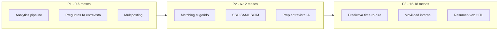

*La tabla §10.2 es la fuente priorizada; el diagrama muestra secuenciación temporal.*

---

## 10.2 Iniciativas priorizadas

### Prioridad 1 — Post-MVP inmediato (0–6 meses)

| Iniciativa | Valor de negocio | Complejidad | Dependencias existentes | Relación con MVP |
|------------|------------------|-------------|-------------------------|------------------|
| **P1.1 — Analytics avanzado de pipeline** | Dashboards time-to-hire, conversión por estado, ratio `OVERRIDDEN`; demuestra ROI (H-B2, métricas §2.1) | **Media** | `application`, `ai_recommendation`, `interview`; agregaciones SQL / réplica lectura §8.14 | Extiende §3.10 (analítica básica) |
| **P1.2 — Preguntas de entrevista generadas por IA (HITL)** | Reduce tiempo de preparación recruiter/HM; mejora calidad entrevistas | **Baja** | Copiloto §3.11 + `job_offer.requirements`; Azure OpenAI sync en monolito | Misma capa LLM; salida editable, no auto-envío |
| **P1.3 — Multiposting de `JobOffer`** | Más candidatos por vacante; menos trabajo manual en portales | **Media** | `job_offer`, APIs LinkedIn/InfoJobs (integración REST) | §3.2 limitación MVP explícita |
| **P1.4 — Informes de equidad / sesgo IA** | Confianza B2B UE; soporte compliance sin automatizar decisiones | **Media** | Histórico `ai_recommendation` + `Evaluation` + demografía opcional consentida | Refuerza HITL y `AuditLog`; no cambia estados automáticamente |
| **P1.5 — Optimización operativa infra** | Cumple NFR-SCL/PER sin rediseño; margen coste (NFR-CST) | **Baja** | RDS réplica lectura, Redis rate limit §8.14, tuning OpenSearch | Mismo stack AWS §8 |

### Prioridad 2 — Crecimiento (6–12 meses)

| Iniciativa | Valor de negocio | Complejidad | Dependencias existentes | Relación con MVP |
|------------|------------------|-------------|-------------------------|------------------|
| **P2.1 — Matching candidato ↔ vacante (sugerencias)** | Reutiliza talento en `Organization`; acelera vacantes difíciles | **Alta** | OpenSearch embeddings; `candidate`, `job_offer`; **AI Service** ampliado o endpoint monolito con vector store | Complementa §3.8 búsqueda; **solo sugerencias**, recruiter confirma |
| **P2.2 — Asistente de preparación de entrevista** | Brief unificado pre-`Interview`: CV + `AIRecommendation` + `Evaluation` | **Media** | UC-03 + datos UC-02; generación LLM resumida | UX sobre mismo agregado `Application` |
| **P2.3 — SSO SAML + SCIM (enterprise ligero)** | Desbloquea empresas 200–500 empleados; reduce fricción IT | **Media** | Auth0 plan B2B §8.9; `user` mapping existente | §3.1 limitación MVP |
| **P2.4 — Reglas de workflow configurables (catálogo ampliado)** | Automatiza recordatorios sin BPM pesado | **Media** | Motor reglas §3.9; `notification` events | No editor visual en fase 2.4 |
| **P2.5 — Screening batch controlado** | Picos de volumen agencia; misma cola SQS con prioridad | **Media** | SQS + AI Service + cuotas `ai_quota_monthly` | Extensión UC-01 async; HITL por candidato intacto |
| **P2.6 — Canal SMS / WhatsApp notificaciones** | Mejor respuesta candidatos scheduling (UC-03 4.C3) | **Media** | Notification Service + proveedor SMS (Twilio SES alternativas) | §3.7 canales adicionales |

### Prioridad 3 — Madurez (12–18 meses)

| Iniciativa | Valor de negocio | Complejidad | Dependencias existentes | Relación con MVP |
|------------|------------------|-------------|-------------------------|------------------|
| **P3.1 — Analítica predictiva time-to-hire** | Forecast por `JobOffer`/etapa; planificación capacidad recruiter | **Alta** | Histórico ≥6 meses por tenant; warehouse ligero o tablas agregadas | Evolución P1.1; **no** predice «quién contratar» |
| **P3.2 — Movilidad interna** | Vacantes visibles para empleados actuales; retención talento | **Alta** | Nuevo flujo `Application` origen `INTERNAL`; roles HM | Dominio ATS ampliado; sigue multi-tenant |
| **P3.3 — Transcripción y resumen de entrevista (voz)** | Acelera documentación post-`Interview`; evidencia para `Evaluation` | **Alta** | Audio en S3 (nuevo `attachment` tipo); Azure Speech + LLM resumen **HITL** | No analiza «personalidad» ni auto-score |
| **P3.4 — Editor visual de workflow (limitado)** | Self-service reglas §3.9 para admins | **Alta** | Estados `Application` fijos; UI sobre catálogo reglas | Riesgo ops; solo si P2.4 insuficiente |
| **P3.5 — PostgreSQL RLS + auditoría reforzada** | Refuerzo NFR-SEC-01 para clientes regulados | **Media** | Políticas RLS por `organization_id` §8.14 | Infra, sin cambio dominio |
| **P3.6 — Integración HRIS export (contratación)** | Cierre loop al `HIRED`; menos doble entrada HR | **Media** | Webhook/API unidireccional desde monolito | Post-estado terminal; no sincroniza nómina |

---

## 10.3 Evolución por componente (sin ruptura arquitectónica)

| Componente | Evolución incremental | Qué no hacer |
|------------|----------------------|--------------|
| **LTI API Monolith** | Módulos nuevos (`integrations`, `analytics`, `matching-api`) | Partir monolito en microservicios por CRUD |
| **AI Candidate Evaluation Service** | Nuevos tipos de job SQS: `matching.embed.requested`, manteniendo **callback API** | Acceso directo BD; decisión autónoma |
| **Notification Service** | Plantillas y canales; mismos eventos | Lógica de dominio pipeline |
| **OpenSearch** | Índices embeddings + keywords | Reemplazar PostgreSQL como fuente de verdad |
| **Cola SQS** | Colas prioritarias screening vs indexación | Kafka |
| **Frontend** | Vistas analytics, wizard multiposting, panel sesgo IA | App móvil nativa (usar PWA responsive primero) |

---

## 10.4 Hitos y validación de valor

| Hito | Plazo orientativo | Criterio de éxito verificable |
|------|-------------------|-------------------------------|
| **H1 — ROI analytics** | +3 meses post-MVP | 5 clientes usan dashboard semanal; reducción ≥15 % tiempo medio en `SCREENING` (vs baseline MVP) |
| **H2 — Multiposting** | +6 meses | ≥30 % `Application` con fuente portal integrado |
| **H3 — Matching piloto** | +9 meses | ≥20 % vacantes usan sugerencias; 0 contrataciones sin acción recruiter |
| **H4 — Enterprise SSO** | +9 meses | 2 logos ≥200 empleados con SAML activo |
| **H5 — Predictiva operativa** | +15 meses | Error forecast time-to-hire **< 20 %** MAPE en piloto interno |

---

## 10.5 Relación con exclusiones MVP (§3.0, §9.12)

| Exclusión MVP | Roadmap cómo la aborda |
|---------------|------------------------|
| Sin multiposting | P1.3 |
| Sin matching predictivo global | P2.1 (sugerencias HITL) |
| Sin analítica predictiva | P3.1 (operativa, no hiring decision) |
| Sin voz | P3.3 (resumen asistido HITL) |
| Sin mobility interna | P3.2 |
| Sin workflow visual | P3.4 tardío y acotado |
| Copiloto limitado | P1.2, P2.2 |

---

## 10.6 Líneas rojas permanentes (GDPR + ética producto)

Independientemente de la fase:

1. **HITL obligatorio** para cualquier recomendación que influya en `Application.status`.
2. **Explicabilidad** (`reasons`, `evidence`, `model_version`) en toda nueva feature de **AI Candidate Evaluation Service** o LLM en monolito.
3. **Residencia y minimización UE** (NFR-GDPR-02/06).
4. **Sin perfilado automático prohibido** (categorías sensibles) para descarte automatizado.

---

# 11. Conclusiones

El diseño de **LTI** define un ATS SaaS multi-tenant orientado al segmento europeo medio (organizaciones con 50–500 empleados), con un alcance MVP acotado pero técnicamente implementable. Las decisiones de producto (Lean Canvas §2), dominio (§5), casos de uso (§4), arquitectura (§6–§7), stack (§8), NFR (§9) y roadmap (§10) forman un sistema coherente: el negocio exige trazabilidad y cumplimiento; el modelo de datos y la arquitectura lo materializan sin prometer automatización opaca.

## 11.1 Valor del sistema

LTI concentra el ciclo de selección en un **pipeline único** (`JobOffer` → `Application` → screening → colaboración → `Interview` → decisión), sustituyendo herramientas paralelas que fragmentan la colaboración recruiter–hiring manager. El valor verificable no reside en «tener IA», sino en:

- **Reducción del tiempo en preselección** mediante screening asíncrono asistido (UC-01, hipótesis H-B2).
- **Trazabilidad de decisiones** vía `AuditLog`, estados explícitos y evaluaciones estructuradas (UC-02).
- **Menor fricción operativa** en coordinación de entrevistas y notificaciones (UC-03, §3.6–§3.7).
- **Adecuación regulatoria UE** como requisito de diseño, no como add-on (consentimiento, retención, minimización en cola y logs).

La viabilidad comercial del MVP depende de validar precio por `Organization` (§2.1) y cuota de inferencia IA controlada (NFR-CST-02), no de escalar prematuramente a funcionalidades enterprise.

## 11.2 Arquitectura final resumida

La arquitectura adoptada es un **modular monolith (NestJS + PostgreSQL)** como fuente de verdad y orquestador de reglas RBAC, complementado por **dos workers desacoplados**:

1. **AI Candidate Evaluation Service** (Python, consumidor SQS) — inferencia y callback al monolito.
2. **Notification Service** (NestJS, consumidor SQS) — email SES e in-app.

La comunicación entre procesos es **asíncrona por cola** para screening y notificaciones; la API REST permanece síncrona para interacción humana. OpenSearch cubre búsqueda con consistencia eventual; S3 almacena `Attachment`. El despliegue target es **ECS Fargate** en región UE, definido por Terraform (§8).

**Tradeoff central aceptado:** mayor simplicidad operativa (tres artefactos desplegables, un esquema relacional) frente a escalabilidad ilimitada horizontal de dominios independientes. La evolución prevista (§10.3) extiende módulos y tipos de mensaje, no reescribe el núcleo.

## 11.3 Rol de la inteligencia artificial

La IA en LTI es **asistiva y acotada**:

| Principio | Implementación |
|-----------|----------------|
| **HITL** | Toda `AIRecommendation` pasa por `PENDING_REVIEW` hasta acción del `Recruiter` (`ACCEPTED`, `REJECTED`, `OVERRIDDEN`); NFR-SEC-05 bloquea avance a `INTERVIEW` sin revisión |
| **Explicabilidad** | `score`, `reasons`, `evidence`, `model_version` persistidos (§5.3.7, NFR-AUD-03) |
| **Límite de autonomía** | El AI Service no escribe en BD ni cambia `Application.status`; patrón **callback API** (§7) |
| **Copiloto** | Generación bajo demanda en monolito (§3.11), siempre editable |

Este modelo reduce riesgo legal y de sesgo operativo frente a ATS que aplican score automático al pipeline. El coste variable de tokens se acota por `ai_quota_monthly` y elección de modelos (`gpt-4o-mini` en screening).

## 11.4 Escalabilidad realista

Los NFR §9 fijan expectativas medibles para MVP: hasta **50 tenants**, screening **≤ 200 jobs/h**, API **p95 ≤ 500 ms** en lecturas, disponibilidad **99,5 %** mensual. La escalabilidad se logra por:

- Instancias stateless del monolito detrás de ALB.
- Workers AI y notificación escalables por profundidad de cola SQS.
- Índices compuestos `(organization_id, …)` y denormalización controlada del tenant en tablas hijas.

No se asume sharding multi-región ni active-active en MVP. El cuello de botella previsible es **inferencia LLM y coste**, no PostgreSQL, para el volumen objetivo del segmento.

## 11.5 Cumplimiento GDPR y confianza

El cumplimiento se integra en tres capas:

1. **Dominio:** `consent_given_at`, `retention_days`, soft delete `candidate.deleted_at`, export/borrado operativos (NFR-GDPR-03/04).
2. **Arquitectura:** mensajes SQS sin PII; logs sin texto de CV; residencia UE AWS + Azure OpenAI (NFR-GDPR-02/06/07).
3. **Proceso:** `AuditLog` append-only en acciones sensibles; informes de sesgo planificados en roadmap P1.4 sin automatizar descartes.

La arquitectura **no garantiza** certificación legal por sí sola; habilita evidencias técnicas para DPIA y contratos con clientes europeos.

## 11.6 Síntesis de tradeoffs principales

| Decisión | Beneficio | Coste / riesgo mitigado en anexo D |
|----------|-----------|-------------------------------------|
| Monolith + 2 servicios | Ops simple, equipo pequeño | Dos runtimes (Node + Python) |
| Callback API vs BD compartida AI | Límite claro, auditoría centralizada | Latencia extra vs escritura directa |
| SQS vs Kafka | Coste y curva aprendizaje bajos | Orden global no garantizado |
| OpenSearch managed | UX búsqueda | Coste fijo mensual |
| Auth0 + Azure OpenAI | Time-to-market UE | Dependencia proveedores |
| 99,5 % disponibilidad | Realista MVP | Ventanas mantenimiento planificadas |

## 11.7 Cierre

LTI es diseñable e implementable como MVP con el stack y los límites documentados. La coherencia entre **modelo relacional multi-tenant**, **workflows UC-01–03** y **fronteras de servicios** reduce el riesgo de deuda arquitectónica temprana. Las extensiones del §10 mantienen HITL y el núcleo de dominio; las líneas rojas §10.6 delimitan evoluciones de IA no admisibles en el producto.

Los anexos A–D operacionalizan supuestos, estructura de repositorio, revisión de cambios y riesgos técnicos concretos para la ejecución del proyecto.

---

## A. Estructura propuesta del repositorio GitHub

Estructura alineada con el monorepo §8.11 y la entrega académica (`LTI-MMX/` en el repositorio colaborativo del curso):

```text
AI4Devs-design-1-2604/                 # Repositorio colaborativo del tema
├── ReadMe.md
├── .gitignore
└── LTI-MMX/                           # Carpeta de entrega del autor (MMX)
    ├── LTI-MMX.md                     # Este documento
    ├── prompts.md                     # Registro de prompts IA
    └── software/                      # Código futuro (post-diseño) — opcional en fase diseño
        ├── package.json               # pnpm workspaces root
        ├── pnpm-workspace.yaml
        ├── apps/
        │   ├── api/                   # LTI API Monolith (NestJS + Prisma)
        │   │   ├── src/
        │   │   │   ├── modules/       # applications, interviews, tenants, ...
        │   │   │   ├── internal/      # screening context + callback controllers
        │   │   │   └── main.ts
        │   │   ├── prisma/
        │   │   │   └── schema.prisma
        │   │   └── Dockerfile
        │   ├── web/                   # React + Vite SPA
        │   ├── ai-worker/             # Python SQS consumer
        │   │   ├── worker/
        │   │   └── Dockerfile
        │   └── notification-worker/   # NestJS SQS consumer
        ├── packages/
        │   └── shared/                # DTOs, event types, enums dominio
        ├── infra/
        │   └── terraform/             # RDS, S3, SQS, ECS, OpenSearch
        ├── docs/
        │   ├── local-setup.md
        │   ├── runbooks/
        │   │   └── screening-dlq.md
        │   └── adr/                   # Architecture Decision Records
        └── .github/
            └── workflows/
                ├── ci.yml
                └── terraform-plan.yml
```

**Convenciones verificables:** un PR de código no mezcla cambios de `infra/` con `apps/api/prisma` sin migración documentada; eventos SQS definidos en `packages/shared/src/events/`.

---

## B. Checklist de validación de Pull Request

Checklist para contribuciones al repositorio colaborativo y, posteriormente, al producto LTI.

### B.1 Documentación y entrega académica

- [ ] Cambios de diseño reflejados en `LTI-MMX/LTI-MMX.md` si afectan dominio o arquitectura.
- [ ] Prompts relevantes añadidos a `LTI-MMX/prompts.md` (trazabilidad IA).
- [ ] Carpeta de autor (`LTI-MMX/`) intacta; sin sobrescribir otras carpetas `LTI-*` de compañeros.
- [ ] `git pull --rebase` del remoto antes de push (evitar conflictos, §ReadMe).

### B.2 Dominio y multi-tenant

- [ ] Toda query/índice incluye `organization_id` cuando aplica (§5.1).
- [ ] Transiciones `Application.status` validadas según §5.4 y reglas HITL.
- [ ] Tests de regresión RBAC: `HIRING_MANAGER` no resuelve `AIRecommendation` ni cambia estados (UC-01 4.A4, UC-02 4.B6).

### B.3 APIs y contratos

- [ ] OpenAPI/DTO actualizado para rutas públicas e **internal** screening (§7.4).
- [ ] Payload SQS screening sin PII (NFR-GDPR-02).
- [ ] Callback idempotente por `screening_job_id` (NFR-RES-02).

### B.4 Calidad y seguridad

- [ ] Migración Prisma reversible o nota de irreversibilidad en descripción PR.
- [ ] Sin secretos en código; variables en `.env.example` solo placeholders.
- [ ] Logs y Sentry sin texto de CV (NFR-GDPR-07).
- [ ] `audit_log` en operaciones sensibles nuevas (NFR-AUD-01).

### B.5 Infra y operación

- [ ] `terraform plan` adjunto o en CI sin cambios no intencionados en prod.
- [ ] Imagen Docker build local OK (`docker compose up` smoke).
- [ ] Alarmas/DLQ consideradas si se modifica cola screening.

### B.6 Revisión humana

- [ ] Al menos **1 aprobación** de otro contribuidor en repo colaborativo.
- [ ] Descripción PR: problema, enfoque, cómo probar, riesgos conocidos.

---

## C. Supuestos arquitectónicos y de negocio

Consolidación de supuestos usados en §1–§10 (iteración 0 y decisiones posteriores). Cambiar un supuesto **obligado** a revisar secciones indicadas.

| ID | Supuesto | Secciones impactadas |
|----|----------|----------------------|
| **A1** | SaaS multi-tenant por `Organization` | §5, §6, §9 NFR-SEC-01 |
| **A2** | Aislamiento lógico `organization_id` en BD y API | §5, §6, §9 |
| **A3** | API REST contrato principal | §6, §8 |
| **A4** | Modular monolith evolutivo + 2 servicios desacoplados | §6, §7, §8, §10 |
| **A5** | HITL obligatorio en decisiones asistidas por IA | §3.4, §4, §7, §9, §10.6 |
| **A6** | `AIRecommendation` explicable y versionada | §5, §7, §9 NFR-AUD-03 |
| **A7** | GDPR-by-design (consentimiento, retención, olvido) | §3, §5, §9, §11.5 |
| **A8** | Auth0 OIDC; RBAC por `user.role` | §5, §6, §8 |
| **A9** | Binarios en S3; metadatos en PostgreSQL | §5, §6, §8 |
| **A10** | Búsqueda OpenSearch sincronizada por eventos | §6, §8, §9 NFR-RES-03 |
| **A11** | Screening y notificaciones vía SQS async | §4, §6, §7, §8 |
| **A12** | Cloud AWS región UE; compute ECS Fargate | §6, §8, §9 |
| **A13** | LLM Azure OpenAI vía API; capa abstracción | §7, §8, §10 |
| **A14** | Observabilidad CloudWatch + OTel + Sentry desde MVP | §6, §8, §9 |
| **A15** | UI ES/EN; datos candidato en idioma origen | §1, §8 |
| **A16** | Persistencia screening solo vía **callback API** al monolito | §6.6, §7, §8.4 |
| **H-B1** | Precio MVP 149–249 €/mes validable con LOI | §2, §11.1 |
| **H-B2** | Screening IA reduce ≥25 % tiempo en `SCREENING` | §2, §4, §10 H1 |

---

## D. Riesgos técnicos y tradeoffs

Riesgos **específicos de LTI**, con mitigación concreta (no lista genérica de «seguridad importante»).

| Riesgo | Probabilidad | Impacto | Mitigación | Indicador temprano |
|--------|--------------|---------|------------|-------------------|
| **Fuga cross-tenant** por query sin filtro | Media | Crítico | Guards + tests contractuales + revisión checklist B.2; RLS en P3.5 | Test integración falla; alerta acceso anómalo |
| **Coste LLM supera margen** (screening masivo) | Alta | Alto | `ai_quota_monthly`, `gpt-4o-mini`, dashboard tokens por tenant (NFR-CST-02) | Coste Azure > 30 % revenue infra |
| **Callback screening falla / timeout** | Media | Alto | Idempotencia, DLQ, runbook `screening-dlq.md`, recruiter notificado `FAILED` | DLQ > 0; `screening_job_status FAILED` ↑ |
| **Drift índice OpenSearch vs PostgreSQL** | Media | Medio | Reindex job; búsqueda no bloquea pipeline; 503 degradado (NFR-RES-03) | Quejas «candidato no aparece» recién creado |
| **Dependencia Auth0/Azure indisponible** | Baja | Alto | JWT cache JWKS; cola screening tolera reintentos; comunicación status page | 5xx login o LLM regional outage |
| **PII en logs o mensajes cola** | Media | Crítico (GDPR) | Validadores schema publish; scrubbing Sentry; revisión NFR-GDPR-07 | Auditoría muestra email en log |
| **Dos runtimes (Node + Python)** | Media | Medio | Monorepo documentado; contratos en `packages/shared`; ADR cambios API | Retraso fixes screening por falta perfil Python |
| **Saturación RDS escrituras** | Baja en MVP | Medio | Réplica lectura P1.5; paginación; evitar N+1 Prisma | CPU RDS > 80 % sostenido |
| **Scope creep a autonomía IA** | Media | Alto (reputación) | Líneas rojas §10.6; NFR-SEC-05; revisión producto en PRs feature IA | PR introduce transición estado por score |
| **Cola notificaciones atrasada** | Media | Bajo-Medio | Alarma lag; escalado worker; email no bloquea API (NFR-RES-04) | Candidatos sin confirmación > 24 h |

**Tradeoff aceptado no mitigado completamente en MVP:** dependencia de proveedores cloud UE (AWS + Microsoft); la salida requeriría multi-cloud o self-host LLM (descartado en §8 por coste).

---

## Glosario

| Término | Definición |
|---------|------------|
| **Application** | Postulación de un `Candidate` a una `JobOffer`; portadora del pipeline |
| **AIRecommendation** | Salida explicable del screening IA; estados con HITL |
| **HITL** | Human-in-the-loop: revisión humana obligatoria antes de impacto en decisiones |
| **Organization** | Tenant SaaS; unidad de aislamiento de datos |
| **Screening** | Fase `SCREENING` y proceso async UC-01 |
| **Callback API** | `POST` interno desde AI Service al monolito; el monolito persiste el resultado |

---

## Referencias

- Ashby, Greenhouse, Lever — referencia de mercado ATS (funcionalidad, no arquitectura).
- Modelo C4 (Simon Brown) — §7.
- Reglamento (UE) 2016/679 (GDPR) — requisitos §9, §11.5.
- Documentación AWS: ECS, SQS, RDS, OpenSearch Service — §6, §8.
- Documentación Azure OpenAI — §8.10.